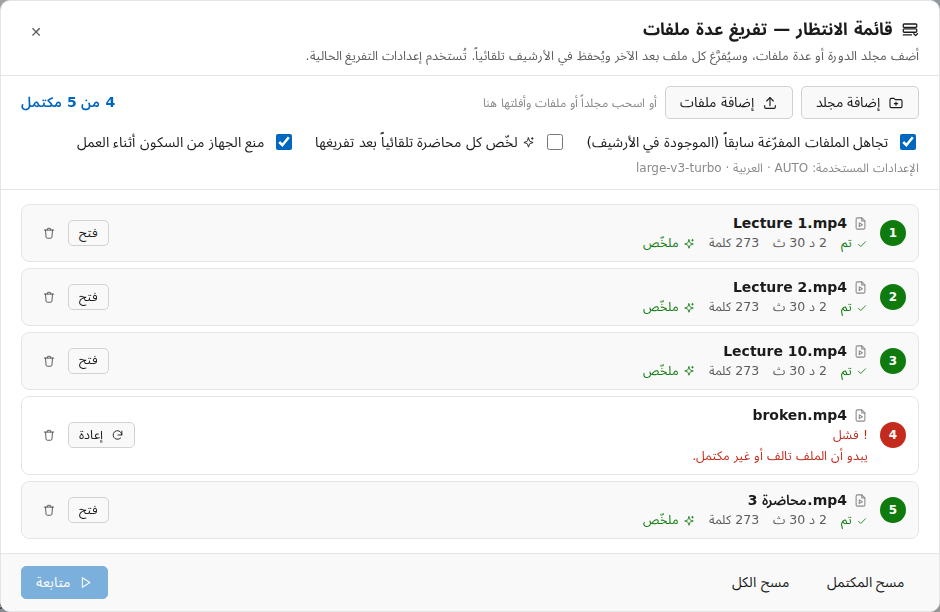
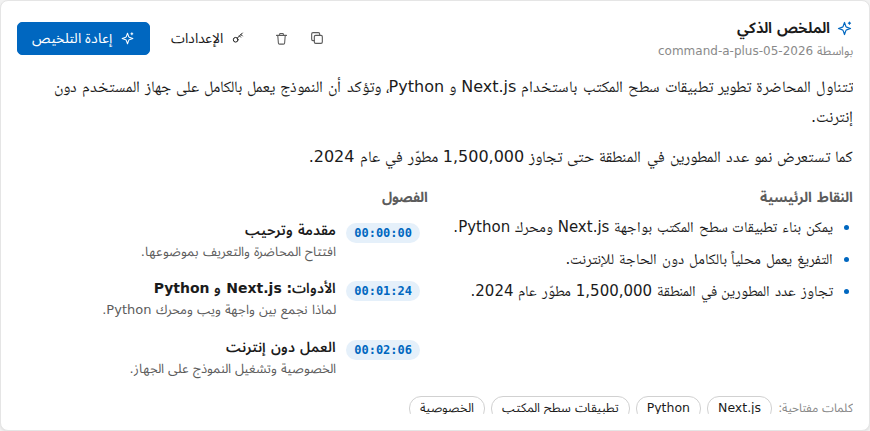
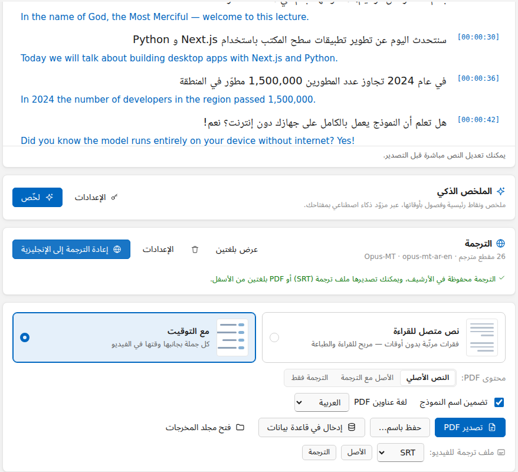

<div align="center">


# المفرّغ المحلي — Local Transcriber

**تفريغ الفيديو والصوت إلى نص على ويندوز، بخصوصية تامة ودون إنترنت، مصمَّم للعربية أولاً.**

أسقِط ملف فيديو ← يُفرَّغ **على جهازك أنت** ← عدّل النص ← صدّره ملف **PDF** عربي منسّق.

[](#المتطلبات)
[](https://nodejs.org)
[](https://www.python.org)
[](https://github.com/SYSTRAN/faster-whisper)
[](LICENSE)

[English](README.md) · **العربية**


</div>

---

## المحتويات

- [المميزات](#المميزات)
- [المتطلبات](#المتطلبات)
- [التشغيل السريع](#التشغيل-السريع)
- [تسجيل الدخول](#تسجيل-الدخول)
- [طريقة الاستخدام](#طريقة-الاستخدام)
- [التفريغ المباشر](#التفريغ-المباشر)
- [اختيار النموذج](#اختيار-النموذج)
- [المزوّدون المدفوعون (Cohere و OpenAI و Groq)](#المزوّدون-المدفوعون-cohere-و-openai-و-groq)
- [الأرشيف](#الأرشيف)
- [قائمة الانتظار (مجلد كامل)](#قائمة-الانتظار-مجلد-كامل)
- [الملخص الذكي والفصول](#الملخص-الذكي-والفصول)
- [اسأل الدورة](#اسأل-الدورة)
- [الترجمة وملفات الترجمة للفيديو](#الترجمة-وملفات-الترجمة-للفيديو)
- [المشغّل والتصدير والفيديو المترجم](#المشغّل-والتصدير-والفيديو-المترجم)
- [فيديوهات يوتيوب](#فيديوهات-يوتيوب)
- [الإدخال في قاعدة بيانات](#الإدخال-في-قاعدة-بيانات)
- [دعم كرت الشاشة NVIDIA](#دعم-كرت-الشاشة-nvidia)
- [بناء ملف تثبيت لويندوز](#بناء-ملف-تثبيت-لويندوز)
- [حل المشاكل](#حل-المشاكل)
- [هيكل المشروع](#هيكل-المشروع)
- [الخصوصية](#الخصوصية)
- [الترخيص](#الترخيص)

---

## المميزات

- 🔒 **محلي 100% افتراضياً**: مع Whisper المحلي لا يُرفع أي ملف إلى الإنترنت. لا حسابات، ولا مفاتيح API، ولا اشتراكات.
- 📴 **يعمل دون إنترنت**: يُنزَّل نموذج الذكاء الاصطناعي مرة واحدة فقط، ثم يعمل كل شيء دون اتصال.
- 🇸🇦 **العربية أولاً**: واجهة من اليمين لليسار، وخطوط عربية واضحة، ونماذج تتعامل مع اللهجات، إضافة إلى نحو 99 لغة أخرى مع كشف تلقائي للغة.
- ⚡ **سريع**: يعتمد على [faster-whisper](https://github.com/SYSTRAN/faster-whisper) و CTranslate2، ويستخدم كرت شاشة NVIDIA تلقائياً عند توفره، مع معالجة دفعية وتخطٍّ للصمت.
- 🎬 **يدعم الصيغ الشائعة**: MP4 و MKV و AVI و MOV و WEBM و MP3 و WAV و M4A و FLAC وغيرها، مع السحب والإفلات.
- ✍️ **نص مباشر قابل للتعديل**: يظهر النص أثناء التفريغ، ويمكنك البحث فيه وتصحيحه والتبديل إلى وضع القراءة.
- ☁️ **مزوّدون مدفوعون اختيارياً**: Cohere Transcribe أو OpenAI أو Groq بمفتاحك الخاص.
- 🗂️ **أرشيف**: كل تفريغ يُحفظ تلقائياً، مع البحث وإعادة الفتح.
- 📚 **قائمة انتظار**: أضف مجلد الدورة كاملاً واتركه يُفرَّغ ملفاً بعد الآخر وأنت نائم، ويُحفظ كل ملف في الأرشيف.
- 🌐 **ترجمة وملفات ترجمة للفيديو**: من العربية إلى الإنجليزية مجاناً على جهازك، أو عبر DeepL أو Azure أو مفتاح الذكاء الاصطناعي، مع عرض بلغتين وملفات SRT/VTT و PDF بلغتين.
- ✨ **ملخص ذكي وفصول**: ملخص ونقاط رئيسية وفصول بأوقاتها بمفتاحك لدى Claude أو OpenAI أو Cohere أو Groq (يُرسل النص فقط).
- 💬 **اسأل الدورة**: اسأل سؤالاً عن دورة كاملة واحصل على الإجابة مع رقم الدرس والدقيقة.
- 🎞️ **مشغّل مربوط بالنص**: اضغط على أي جملة ليبدأ التشغيل منها، والجملة الحالية تُظلَّل. ومعه **فيديو والترجمة مكتوبة عليه** جاهز للرفع على يوتيوب أو إنستغرام.
- 🌍 **موقع للدورة**: صدّر الدورة موقعاً صغيراً يعمل دون إنترنت (صفحة لكل درس وبحث في كل الدورة)، مع تصدير Word ونص عادي و JSON.
- 📊 **إحصائيات**: كم ساعة فرّغت، وحسب الدورة والشهر، وما الذي ينقصه ملخص أو ترجمة.
- ▶️ **روابط يوتيوب**: يستخدم ترجمة الفيديو الموجودة إن وُجدت، وإلا ينزّل الصوت فقط ويفرّغه.
- 🗄️ **الإدخال في قاعدة بياناتك**: SQL Server أو Oracle أو MySQL أو PostgreSQL، بجملة SQL تكتبها أنت.
- 📄 **تصدير PDF عربي سليم**: حروف متصلة، واتجاه صحيح من اليمين لليسار، ودعم النص المختلط (عربي وإنجليزي وأرقام)، مع خيار إظهار التوقيتات.
- 🌙 **وضع فاتح وداكن**، وواجهة بالعربية أو الإنجليزية.

<div align="center">

<br/><sub>نموذج من ملف PDF المُصدَّر</sub>
</div>

---

## المتطلبات

| | الإصدار | طريقة التثبيت |
|---|---|---|
| **ويندوز** | 10 أو 11 (64-بت) | — |
| **Node.js** | **22.12 أو أحدث** | `winget install OpenJS.NodeJS.LTS` أو من [nodejs.org](https://nodejs.org) |
| **Python** | من 3.10 إلى 3.13 (يُنصح بـ 3.12) | `winget install Python.Python.3.12` أو من [python.org](https://www.python.org/downloads/windows/). فعّل خيار **“Add python.exe to PATH”** أثناء التثبيت |
| **Git** | أي إصدار | `winget install Git.Git` |
| كرت شاشة NVIDIA | *اختياري* | يكفي تعريف NVIDIA محدَّث، ولا حاجة لتثبيت CUDA Toolkit. |

> **لا حاجة** لتثبيت FFmpeg بنفسك، فهو يُنزَّل تلقائياً أثناء التثبيت.

للتحقق من الإصدارات المثبتة:

```bash
node -v      # يجب أن يكون v22.12.0 أو أعلى
python --version
```

---

## التشغيل السريع

```bash
# 1. تنزيل المشروع
git clone https://github.com/<your-username>/windowsApplication.git
cd windowsApplication

# 2. تثبيت كل شيء (حزم JavaScript + بيئة Python + FFmpeg)
npm install

# 3. تشغيل التطبيق
npm run dev
```

بعد ثوانٍ تُفتح نافذة التطبيق.

يستغرق `npm install` بضع دقائق في المرة الأولى، لأنه يثبّت حزم JavaScript، وينشئ بيئة Python معزولة في `backend/.venv`، ويثبّت faster-whisper، ويثبّت مكتبات CUDA إذا وُجد كرت NVIDIA. أما إعادة تشغيله لاحقاً فتكون سريعة.

> 💡 **نصيحة:** يُفضَّل ألّا تضع المشروع داخل مجلد تزامنه OneDrive، لأن مجلدَي `node_modules` و `backend/.venv` كبيران وسيحاول OneDrive مزامنتهما.

---

## تسجيل الدخول

يفتح التطبيق على **شاشة تسجيل الدخول** وفيها تبويبان: **تسجيل الدخول** و**إنشاء حساب**. الحسابات محفوظة في الخدمة المركزية **WindowsAppLoginBackend** (مشروع ASP.NET Core منفصل، راجع ملف README الخاص به)، ويشير إليها `apiBaseUrl` في ملف `auth-config.json` (`http://localhost:5080` أثناء التطوير، وضع عنوان الخادم قبل بناء ملف التثبيت). أول حساب يُنشأ يصبح المسؤول. خيار **تذكّرني على هذا الجهاز** يُبقيك مسجلاً (مشفّراً بحماية ويندوز) حتى تنتهي صلاحية الرمز، ويُعاد التحقق من الجلسة مع الخدمة عند كل تشغيل، فإذا أُوقف الحساب أو تغيّرت كلمة المرور يخرج التطبيق منه، وبدون إنترنت تبقى الجلسة المحفوظة تعمل. زر **تسجيل الخروج** في الشريط العلوي. رابط **نسيت كلمة المرور؟** تحت حقل كلمة المرور يرسل رمزاً من 6 أرقام إلى بريدك؛ تكتبه مع كلمة مرور جديدة فتدخل مباشرة، ويُسجَّل الخروج من أي جهاز آخر.

القفل موجود في العملية الرئيسية لـ Electron: قبل نجاح الدخول لا تحصل النافذة على أي اتصال بمحرك التفريغ المحلي ولا على المفاتيح المحفوظة، فإخفاء الشاشة لا يفتح شيئاً. الخيار `"enabled": false` في `auth-config.json` يعطّل الدخول أثناء التطوير فقط، أما النسخة المثبّتة فتطلب الدخول دائماً. طلب تسجيل الدخول وحده يمر عبر الإنترنت، والتفريغ يبقى على جهازك.

---

## طريقة الاستخدام

1. **اختر ملفاً**: اسحب ملف فيديو أو صوت وأفلته داخل النافذة، أو اضغط **اختيار ملف**.
2. **اضبط الإعدادات** (الإعدادات الافتراضية مناسبة للعربية):
   - **النموذج**: راجع قسم [اختيار النموذج](#اختيار-النموذج).
   - **لغة الكلام**: العربية افتراضياً، أو اختر **كشف تلقائي**.
   - **المعالج**: في وضع *تلقائي* يُستخدم كرت الشاشة إذا كان قوياً بما يكفي، وإلا فالمعالج المركزي.
   - **الأولوية**: *الأسرع* أو *متوازن* (موصى به) أو *الأدق*.
3. اضغط **بدء التفريغ**. عند استخدام نموذج لأول مرة يُنزَّل تلقائياً مع شريط تقدم.
4. تابع النص وهو يظهر مباشرة، ويمكنك **الإلغاء** في أي وقت.
5. **عدّل** أي سطر مباشرة، أو **ابحث** في النص، أو انتقل إلى **وضع القراءة**.
6. اضغط **تصدير PDF** (أو **حفظ باسم…**)، واختر إن كنت تريد إظهار التوقيتات.
7. اضغط **فتح مجلد المخرجات** للوصول إلى ملفات PDF (المجلد الافتراضي: `Documents\Local Transcriber`).

---

## التفريغ المباشر

بطاقة **تفريغ مباشر** (تحت خانة يوتيوب) تحوّل الكلام إلى نص أثناء قوله:

- **الميكروفون**: محاضرة حضورية أو ملاحظات صوتية. **صوت الجهاز**: كل ما يشغّله الجهاز (محاضرة Zoom أو Teams، فيديو يوتيوب؛ في ويندوز فقط). **الاثنان معاً**: اجتماع أونلاين تشارك فيه بصوتك.
- يظهر النص بعد كل جملة بثانية أو ثانيتين (التوقف القصير ينهي الجملة، والكلام الطويل يُقطع عند أنسب وقفة كل ~١٤ ثانية). وإذا كان الجهاز أبطأ من الكلام يعرض كم هو متأخر ثم يلحق.
- يستخدم **النموذج المحلي واللغة المختارين في إعدادات التفريغ** (Whisper أو Cohere العربي)، ولا يُرفع شيء. الأفضل للمتابعة الفورية: `small` أو `large-v3-turbo` مع كرت شاشة، و`base` أو `small` على المعالج.
- **إيقاف وحفظ** يفرّغ آخر الكلام ويحفظ النص في **الأرشيف** (في الدورة التي اخترتها)، ويحتفظ بالتسجيل الصوتي أيضاً (في مجلد `Live recordings` داخل مجلد المخرجات بصيغة `.m4a`) فيُفتح التفريغ المحفوظ مع مشغّله مثل أي ملف. **إلغاء** يحذف الجلسة.
- لا يعمل تفريغ ملف أو قائمة الانتظار في الوقت نفسه (القائمة تنتظر).
- إذا منع ويندوز الميكروفون: *الإعدادات ← الخصوصية والأمان ← الميكروفون ← السماح لتطبيقات سطح المكتب بالوصول إلى الميكروفون*.

---

## اختيار النموذج

| النموذج | الحجم | السرعة | دقة العربية | الأنسب لـ |
|---|---|---|---|---|
| `tiny` | 75 MB | ★★★★★ | ★☆☆☆☆ | التجربة السريعة |
| `base` | 145 MB | ★★★★★ | ★★☆☆☆ | الأجهزة الضعيفة جداً |
| `small` | 485 MB | ★★★★☆ | ★★★☆☆ | الأجهزة المحمولة القديمة |
| `medium` | 1.5 GB | ★★☆☆☆ | ★★★★☆ | — |
| **`large-v3-turbo`** | 1.6 GB | ★★★★☆ | ★★★★☆ | **الافتراضي على المعالج المركزي**: دقة قريبة من الأفضل وسرعة أعلى بكثير |
| **`large-v3`** | 3.1 GB | ★☆☆☆☆ | ★★★★★ | **الافتراضي على كرت شاشة بذاكرة 6 GB أو أكثر**: أفضل دقة للعربية واللهجات |
| `Cohere Transcribe Arabic` *(تجريبي)* | 1.5 GB | ★★★★☆ | ★★★★★ | محاضرات عربية ولهجات، على المعالج المركزي |

**Cohere Transcribe Arabic (تجريبي):** نموذج مفتوح المصدر (Apache 2.0) من Cohere مخصص للعربي: الفصحى واللهجات المصرية والخليجية والشامية والمغاربية، والخلط بين العربي والإنجليزي. في لوحة Hugging Face لتفريغ العربي نسبة خطئه نحو 26% مقابل 37% لـ Whisper large-v3. يعمل محلياً على المعالج المركزي (نسخة 4-bit، نحو 2.4 GB من الذاكرة) عبر ONNX Runtime في عملية منفصلة، وفي تجربتنا على معالج بنواتين كان أسرع بنحو 6 مرات من `large-v3-turbo` بنفس النص. ملفات الرسم (graph) المنشورة للنموذج فيها أخطاء تمنع تحميله، لذلك يأتي التطبيق بنسخة مصلَّحة منها (`backend/assets/cohere`) ويضعها تلقائياً بجانب الأوزان بعد التنزيل. قيوده: العربي والإنجليزي فقط (بدون كشف تلقائي للغة)، ولا يعمل على كرت الشاشة، ولا يعطي توقيتاً داخل الجملة، لذلك يؤخذ توقيت كل مقطع من فترات الكلام (مقاطع حتى 20 ثانية)، ولا يدعم «كلمات خاصة».

- يُنزَّل كل نموذج **مرة واحدة فقط** ويُحفظ في مجلد `models/`، ثم يعمل دون إنترنت.
- يمكنك تنزيل النموذج مسبقاً بزر **تنزيل** بجانبه، أو حذفه بأيقونة 🗑️.
- إذا كان التفريغ بطيئاً على جهازك، جرّب نموذج `small` مع أولوية **الأسرع**.
- **مصطلحات وأسماء خاصة** (الإعدادات ← *كلمات خاصة*): اكتب الأسماء والمصطلحات مفصولة بفواصل (مثل `PostgreSQL، SELECT، د. أحمد`)، فيُكتب النص بتهجئتها الصحيحة. مفيد لأسماء الدورات والمدرّسين والمصطلحات الإنجليزية داخل المحاضرات العربية، ويعمل أيضاً مع OpenAI و Groq.
- **تسريع تلقائي:** يُحمَّل النموذج أثناء استخراج الصوت في الوقت نفسه، وفي قائمة الانتظار يُجهَّز صوت الملف التالي أثناء تفريغ الحالي، فلا يكاد يوجد انتظار بين الملفات.

---

## المزوّدون المدفوعون (Cohere و OpenAI و Groq)

إلى جانب Whisper المحلي، يمكنك التفريغ عبر مزوّد سحابي مدفوع باستخدام **مفتاح API الخاص بك**. الدفع بينك وبين المزوّد مباشرةً، والتطبيق لا يتعامل مع الدفع أبداً.

| المزوّد | النماذج | ملاحظات |
|---|---|---|
| **Cohere Transcribe** | `cohere-transcribe-arabic-07-2026` (للعربية)، `cohere-transcribe-03-2026` (14 لغة) | يتطلب تحديد لغة الكلام، ولا يدعم الكشف التلقائي |
| **OpenAI** | `gpt-4o-transcribe` و `gpt-4o-mini-transcribe` و `whisper-1` | |
| **Groq** | `whisper-large-v3-turbo` و `whisper-large-v3` | سريع جداً |

1. من **إعدادات التفريغ ← محرك التفريغ** اختر **مزوّد مدفوع**.
2. اختر المزوّد والنموذج، والصق مفتاحك، ثم اضغط **اختبار** (فحص مجاني، لا يُفرَّغ فيه شيء).
3. اختر لغة الكلام واضغط **بدء التفريغ** كالمعتاد.

- المفتاح يُحفظ **مشفّراً بتشفير ويندوز (DPAPI)** على جهازك، ولا يُرسل إلا إلى ذلك المزوّد.
- يُرفع **الكلام فقط** من الصوت (يُتخطّى الصمت) على شكل مقاطع قصيرة تُرسل بالتوازي. موقع كل مقطع في الملف الأصلي يعطي التوقيتات، حتى مع المزوّدين الذين لا يرجعون توقيتات، ولا تصطدم أبداً بحد حجم الملف.
- عند اختيار مزوّد مدفوع يظهر في أعلى النافذة **«سحابي: يُرفع الصوت إلى …»**، ليبقى واضحاً دائماً أين يذهب صوتك.

---

## الأرشيف

كل تفريغ يُحفظ تلقائياً في أرشيف محلي، سواء كان من ملف أو رابط يوتيوب، وبـ Whisper المحلي أو بمزوّد مدفوع، وتُحفظ تعديلاتك عليه أيضاً.

- اضغط **الأرشيف** في الشريط العلوي لتتصفح التفريغات، أو **تبحث** فيها (في العناوين والنصوص، مع تجاهل التشكيل واختلاف أشكال الحروف)، أو **تفتحها**، أو **تحذفها**.
- التفريغ المفتوح من الأرشيف يمكن تعديله وتصديره PDF وإدخاله في قاعدة بيانات مثل أي تفريغ جديد.
- **الدورة كاملة بضغطة:** اختر دورة ثم اضغط:
  - **إدخال الدورة على قاعدة البيانات**: تُدخل كل الدروس بإعداد قاعدة بيانات محفوظ (كل درس في transaction مستقلة). ومتغيرات إضافية لكل درس: `@lesson_index` (رقمه في الدورة حسب ترتيب العناوين) و `@lesson_title` و `@course` و `@youtube_id`. وزر **معاينة** يعرض صفوف الدرس الأول قبل التنفيذ.
  - **تصدير الدورة**: مجلد واحد فيه لكل درس `01 - الدرس.pdf` و `01 - الدرس.ar.srt` و `01 - الدرس.en.srt`… (تختار شكل PDF ومحتواه وصيغة ملف الترجمة)، مع ملف `index.csv` يسرد كل الدروس، جاهز للرفع على منصتك.
- **الدورات:** أي مجلد أو قائمة تشغيل يوتيوب تضيفها لقائمة الانتظار تصبح دورة تلقائياً (باسم المجلد أو عنوان القائمة). القائمة الجانبية في الأرشيف تعرض كل الدورات وعدد دروس كل منها، ويمكنك إعادة تسمية الدورة، أو إضافة أي تفريغ إلى دورة (أو إخراجه منها) من صفّه. والبحث يشمل أسماء الدورات أيضاً.
- **بحث واستبدال:** صحّح اسماً أو مصطلحاً يخطئ فيه النموذج في كل المحاضرات دفعة واحدة (مثلاً «الخوارزميه» ← «الخوارزمية»). يعمل على الدورة المختارة (أو كل الأرشيف)، ويتجاهل التشكيل واختلاف أشكال الحروف إلا إذا فعّلت **مطابقة حرفية**، ويعرض كل موضع مع ما حوله لتلغي تحديد المحاضرات التي لا تريد تغييرها، ويصحّح الملخصات أيضاً إن شئت، وزر **تراجع** يعيد النص كما كان قبل آخر استبدال.
- **الإحصائيات:** زر **إحصائيات** يعرض الساعات المفرّغة (الإجمالي وحسب الشهر وحسب الدورة)، وكم درساً في كل دورة ما زال دون ملخص أو ترجمة. اضغط على اسم الدورة لفتحها.
- **موقع للدورة:** في **تصدير الدورة** فعّل **موقع صغير للدورة** فيُنشأ مجلد `website`: صفحة `index.html` فيها قائمة الدروس وبحث في كل الدورة (يتجاهل التشكيل واختلاف أشكال الحروف)، ولكل درس صفحة فيها الملخص والفصول القابلة للنقر والنص، والترجمة خلف زر، مع روابط لملفات PDF و Word والترجمة الخاصة بالدرس. يعمل من المجلد مباشرة دون إنترنت، أو ترفعه على أي استضافة. ومن نفس النافذة يمكن إضافة ملفات **Word** و**نص عادي** و**JSON** لكل درس.
- **نسخة احتياطية ونقل لجهاز آخر:** زر **نسخة احتياطية** يحفظ الأرشيف كاملاً في ملف واحد بامتداد `.ltbackup`، ومعه التفريغات والتعديلات والملخصات والترجمات والدورات. على الجهاز الآخر افتح الأرشيف واضغط **استرجاع نسخة**، فتُدمج العناصر: يُضاف الجديد، ولا يُحذف شيء، وإذا كان عنصر معدّلاً على ذلك الجهاز بعد تاريخ النسخة تبقى نسخته. مفاتيح الخدمات وكلمات مرور قواعد البيانات **لا** تدخل في النسخة، لأنها مشفّرة لكل جهاز على حدة.
- الأرشيف ملف SQLite في `%APPDATA%\Local Transcriber\archive.db` ولا يغادر جهازك أبداً.

---

## قائمة الانتظار (مجلد كامل)

فرّغ دورة كاملة دون أن تضغط **بدء التفريغ** لكل محاضرة:

1. اضغط **قائمة الانتظار** في الشريط العلوي، أو من الشاشة الرئيسية اضغط **مجلد كامل** أو **عدة فيديوهات**، أو اسحب عدة ملفات أو مجلداً وأفلتها في منطقة السحب.
2. اضغط **إضافة مجلد** (تُضاف المجلدات الفرعية أيضاً) أو **إضافة ملفات**، أو اسحب المجلدات والملفات وأفلتها على النافذة. تُرتَّب الملفات ترتيباً طبيعياً (`Lecture 2` قبل `Lecture 10`)، ويمكنك تقديم أي ملف أو تأخيره أو إزالته.
3. اضغط **ابدأ التفريغ**. تُفرَّغ الملفات واحداً بعد الآخر بـ **إعدادات التفريغ الحالية** (النموذج واللغة، محلياً أو بمزوّد مدفوع)، ويُحفظ كل تفريغ مكتمل **في الأرشيف** تلقائياً.

<div align="center"></div>

**قوائم تشغيل يوتيوب:** الصق رابط قائمة التشغيل في حقل يوتيوب داخل قائمة الانتظار (أو في حقل يوتيوب الرئيسي، وسيعرض عليك التطبيق إضافة القائمة كاملة)، فتُضاف كل فيديوهاتها. ولكل فيديو يستخدم التطبيق **ترجمة يوتيوب** إن وُجدت بلغة التفريغ (ترجمة صاحب القناة أولاً ثم التلقائية)، وهذا فوري ودون تنزيل، وإلا ينزّل الصوت فقط ويفرّغه. ويظهر على كل فيديو الطريقة التي استُخدمت. الفيديوهات الخاصة أو المحذوفة تُتجاهل، والموجودة في الأرشيف تُتجاهل أيضاً، فإذا أضفت القائمة لاحقاً تُضاف الدروس الجديدة فقط.

الخيارات:

- **تجاهل الملفات المفرّغة سابقاً**: الملفات الموجودة في الأرشيف لا تُضاف مرة ثانية، فيمكنك إضافة نفس المجلد بعد نزول محاضرات جديدة.
- **لخّص كل محاضرة تلقائياً**: يُنشئ الملخص الذكي (في القسم التالي) بعد تفريغ كل ملف.
- **أدخل كل محاضرة على قاعدة البيانات**: بإعداد محفوظ، مباشرة بعد جهوز تفريغها (وترجمتها وملخصها إذا فعّلتهما). ضع مجلد الدورة في القائمة بالليل، وتجدها على موقعك في الصباح.
- **منع الجهاز من السكون**: لا يدخل ويندوز في وضع السكون ما دامت القائمة تعمل (قد تنطفئ الشاشة فقط).

الملف الذي يفشل (مثل فيديو تالف) يظهر عليه **فشل** مع السبب وزر **إعادة**، وتكمل القائمة بالملف التالي. ولا تتوقف القائمة إلا إذا كانت المشكلة ستتكرر مع كل الملفات الباقية (مفتاح API غير صالح، أو انتهاء الرصيد، أو تعذّر تنزيل النموذج). زر **إيقاف بعد الملف الحالي** ينهي الملف الجاري أولاً، و**إيقاف فوراً** يلغيه. ويُظهر زر الشريط العلوي التقدم (مثل `3/12`) بينما تكمل عملك.

**إذا أُغلق التطبيق قبل أن تنتهي القائمة** (أغلقته أنت، أو أعاد ويندوز التشغيل، أو انقطعت الكهرباء) فالقائمة لا تضيع: عند فتح التطبيق مرة أخرى يظهر تنبيه بعدد الملفات الباقية، وزر **متابعة من حيث توقفت** يكمل العمل (والملف الذي انقطع يُفرَّغ من جديد من أوله). يُحفظ فقط قائمة الملفات ونتائجها، ولا تُحفظ أبداً مفاتيح الخدمات أو كلمات مرور قواعد البيانات.

---

## الملخص الذكي والفصول

في آخر الصفحة (بعد خيارات التصدير)، يُنشئ قسم **الملخص الذكي**:

- **ملخصاً** قصيراً للتسجيل كاملاً،
- **النقاط الرئيسية** (الأفكار والتعريفات والخلاصات)،
- **فصولاً** تتبع تغيّر المواضيع فعلياً، ولكل فصل وقت بدايته. اضغط على أي فصل لتنتقل إليه في النص،
- وكلمات مفتاحية.

يعتمد على نموذج لغوي كبير من مزوّد تختاره، **بمفتاح API الخاص بك** (والدفع بينك وبين المزوّد):

| المزوّد | النماذج الافتراضية |
|---|---|
| **Anthropic (Claude)** | `claude-sonnet-5` و `claude-haiku-4-5-20251001` و `claude-opus-5-5` |
| **OpenAI** | `gpt-5.4-mini` و `gpt-5.4` و `gpt-5-mini` |
| **Cohere** | `command-a-plus-05-2026` و `command-a-03-2025` |
| **Groq** | `openai/gpt-oss-120b` و `llama-3.3-70b-versatile` |

<div align="center"></div>

اختر **نموذج آخر…** لتكتب أي اسم نموذج من وثائق المزوّد. ويمكن كتابة الملخص بلغة النص نفسها أو بالعربية أو بالإنجليزية.

- يُرسل **نص التفريغ فقط**، ولا يُرسل أي صوت أو فيديو، وفقط عندما تضغط **لخّص** (أو تفعّله لقائمة الانتظار).
- المحاضرات الطويلة تُقسَّم إلى أجزاء تُلخَّص ثم تُدمج، فتعمل مع أي طول.
- يُحفظ الملخص مع التفريغ في الأرشيف.
- في ملف PDF (خيار **تضمين الملخص والفصول**) يظهر الملخص قبل النص، وقائمة الفصول قابلة للضغط، ويصبح كل فصل عنواناً وعلامة (Bookmark) داخل النص.
- المفاتيح مشتركة مع مزوّدي التفريغ المدفوعين، وتُحفظ مشفّرة (Windows DPAPI).

> قد يحتوي الملخص الآلي على أخطاء، فراجِعه قبل الاعتماد عليه.


**ذكاء اصطناعي مجاني دون مفتاح:** إذا لم يضع المستخدم مفتاح Groq خاصاً به، يعمل الملخص والترجمة و«اسأل الدورة» والتفريغ السحابي عبر Groq **من خلال خادم الحسابات** (WindowsAppLoginBackend): التطبيق يرسل الطلب مع جلسة المستخدم، والخادم يضيف المفتاح الحقيقي (المحفوظ فيه فقط، في `appsettings.Secrets.json` تحت `Ai:Groq:ApiKey`) ويطبّق **رصيداً يومياً لكل مستخدم** (`Ai:DailyChatRequests` و`Ai:DailyAudioMB`؛ المسؤول بلا حد). لا يوجد أي مفتاح داخل ملف التثبيت. وإذا حفظ المستخدم مفتاحه الخاص يُستخدم مباشرة مع Groq بلا حدود من الخادم. (للتطوير فقط: ملف `builtin-keys.json` في جذر المشروع ما زال يعمل في `npm run dev`، ولا يدخل ملف التثبيت.)
---

## اسأل الدورة

تستخدم نفس المزوّد والمفتاح المستخدمين في [الملخص الذكي](#الملخص-الذكي-والفصول)، ويُرسل النص فقط.

**اسأل الدورة:** افتح دورة في الأرشيف واضغط **اسأل الدورة**. اكتب سؤالك (مثلاً: *«وين شرح الربط بين الجداول؟»*)، فتأتي الإجابة من نصوص دروس هذه الدورة فقط، مع مصادر مثل `الدرس 3 · 12:40`. اضغط على المصدر ليُفتح الدرس عند هذه الدقيقة. وفي الدورات الكبيرة تُختار المقاطع الأكثر صلة بالسؤال على جهازك أولاً، فيبقى الطلب صغيراً وقليل التكلفة.

---

## الترجمة وملفات الترجمة للفيديو

قسم الترجمة مخفي حتى تحتاجه: اضغط زر **الترجمة** في شريط أدوات النص ليظهر. يترجم كل جملة **مع وقتها**، فتحصل على:

- **عرض النص بلغتين** (ويمكنك تعديل السطرين)،
- **ملفات ترجمة للفيديو** بصيغة `SRT` أو `VTT`، للنص الأصلي أو للترجمة (مثل `lecture.en.srt`)، جاهزة للرفع على يوتيوب أو منصة الدورات. الجمل الطويلة تُقسَّم إلى ترجمات مقروءة لا تزيد عن سطرين،
- **ملف PDF بلغتين**: اختر **النص الأصلي** أو **الأصل مع الترجمة** أو **الترجمة فقط**،
- وتُحفظ الترجمة في الأرشيف، ويمكن لـ **قائمة الانتظار** أن تترجم كل محاضرة تلقائياً.

<div align="center"></div>

اختر طريقة الترجمة:

| الطريقة | التكلفة | ملاحظات |
|---|---|---|
| **مجاني على الجهاز** | مجانية | بدون إنترنت. من العربية إلى الإنجليزية بنموذج [Opus-MT](https://huggingface.co/Helsinki-NLP/opus-mt-ar-en) (حوالي 150 ميجابايت يُنزَّل مرة واحدة). جودة متوسطة: جيدة للفهم العام، وأضعف مع العامية والمصطلحات النادرة |
| **ذكاء اصطناعي بمفتاحك** | مدفوعة منك (غالباً سنتات للمحاضرة) | Claude أو OpenAI أو Cohere أو Groq، بنفس مفاتيح الملخص الذكي. أعلى جودة: يفهم السياق والمصطلحات التقنية ويصحح أخطاء التفريغ |
| **DeepL** | حصة مجانية شهرية ثم مدفوعة | جودة ممتازة. مفتاح الخطة المجانية ينتهي بـ `:fx`، وزر **اختبار** يُظهر استهلاكك هذا الشهر |
| **Azure AI Translator** | حصة مجانية شهرية (F0) ثم مدفوعة | اكتب منطقة المورد (مثل `westeurope`) إلا إذا كان المورد عاماً (Global) |

الطرق التي تعمل عبر الإنترنت تستقبل **نص التفريغ فقط**، ولا يُرسل أي صوت أو فيديو. ويمكن أن تكون اللغة الهدف الإنجليزية أو العربية (مثلاً لترجمة محاضرة إنجليزية إلى العربية بطريقة عبر الإنترنت).

---

## المشغّل والتصدير والفيديو المترجم

- **المشغّل:** اضغط **المشغّل** فوق النص (أو على أي وقت مثل `[00:12]`) ليعمل الملف داخل التطبيق. الجملة التي تُقال الآن تُظلَّل ويتبعها النص (ألغِ **تتبّع النص** لتقرأ بحرية)، والضغط على أي وقت أو فصل أو فقرة في وضع القراءة أو وقت سؤال ينقلك إليه. السرعة من 0.75× إلى 2×، و `Ctrl` مع المسافة للتشغيل والإيقاف، و `Ctrl` مع الأسهم للتقديم أو الرجوع 5 ثوانٍ. تفريغات فيديوهات يوتيوب تستخدم مشغّل يوتيوب نفسه (يحتاج إنترنت). وإذا كانت الصيغة لا تعمل داخل التطبيق (مثل بعض ملفات AVI أو WMV) يعرض عليك فتح الملف في المشغّل الافتراضي.
- **صيغ أخرى:** بجانب PDF توجد **Word** و**نص عادي** و**JSON** بنفس الخيارات (للقراءة أو مع التوقيت، الأصل أو الترجمة أو الاثنان، الملخص والفصول). ملف Word من اليمين لليسار للعربية، مع عناوين حقيقية (تظهر الفصول في جزء التنقل في Word). وملف JSON فيه كل جملة بأوقاتها مع الترجمة والملخص، ويفيد لموقعك أو برامجك.
- **فيديو بالترجمة:** زر **فيديو بالترجمة** ينشئ ملف MP4 *جديداً* والنص مكتوب على الصورة: الأصل، أو الترجمة، أو الاثنان (الترجمة أصغر وبلون أصفر تحت الأصل). اختر حجم الخط وخلفية داكنة أو حدوداً فقط. يعمل على جهازك بـ FFmpeg، ويستغرق تقريباً نصف مدة الفيديو أو أكثر. الفيديو الأصلي لا يتغيّر أبداً.

---

## فيديوهات يوتيوب

الصق رابط فيديو يوتيوب في الحقل تحت منطقة السحب والإفلات (أو الصقه فقط، فيُجلب تلقائياً):

- **إذا كان للفيديو ترجمة على يوتيوب** تظهر لك قائمة بها: ترجمة صاحب القناة أولاً (الأدق عادةً)، ثم ترجمة يوتيوب التلقائية. اضغط **استخدام** فيظهر النص فوراً مع التوقيتات، دون نموذج ودون تنزيل.
- **إذا لم تكن له ترجمة** يخبرك التطبيق أنه سيُنشئها: اختر النموذج والإعدادات كالمعتاد واضغط **بدء التفريغ**. يُنزَّل **الصوت فقط** (نحو 1 MB لكل دقيقة)، ثم يُفرَّغ محلياً مثل أي ملف.
- يمكنك دائماً تجاهل الترجمة الموجودة والضغط على **بدء التفريغ** لاستخدام Whisper.

كل الميزات الأخرى (التعديل، وتصدير PDF، والإدخال في قاعدة بيانات) تعمل بنفس الطريقة.

> يوتيوب يتغيّر كثيراً. إذا توقفت الروابط عن العمل فجأة، نفّذ `npm run update:youtube` لتحديث أداة يوتيوب ([yt-dlp](https://github.com/yt-dlp/yt-dlp)). فرّغ فقط الفيديوهات التي يحق لك استخدامها.

---

## الإدخال في قاعدة بيانات

بعد التفريغ اضغط **إدخال في قاعدة بيانات** لإضافة النص مباشرة إلى قاعدة بياناتك (**SQL Server أو Oracle أو MySQL/MariaDB أو PostgreSQL**) بجملة SQL تكتبها أنت.

1. اختر نوع القاعدة، والصق **سلسلة الاتصال** (Connection string)، ثم اضغط **اختبار الاتصال**.

   | القاعدة | مثال على سلسلة الاتصال |
   |---|---|
   | SQL Server | `Server=myserver,1433;Database=MyDb;User Id=myuser;Password=mypassword;TrustServerCertificate=True;` |
   | Oracle | `myuser/mypassword@myhost:1521/ORCLPDB1` |
   | MySQL / MariaDB | `Server=myhost;Port=3306;Database=mydb;Uid=myuser;Pwd=mypassword;` |
   | PostgreSQL | `Host=myhost;Port=5432;Database=mydb;Username=myuser;Password=mypassword` |

2. اختر **شكل الإدخال**: صف لكل مقطع بطول N ثانية، أو صف لكل مقطع كما خرج من Whisper، أو صف واحد للنص كاملاً.
3. أضف **متغيراتك** إن احتجت، مثل `lesson_id = 42`.
4. اكتب الجملة واستخدم المتغيرات بعلامة `@` (أو `:` في Oracle):

   ```sql
   -- اختيارية: تُنفَّذ مرة واحدة قبل الإدخال
   DELETE FROM LessonTranscripts WHERE LessonId = @lesson_id;

   -- تُنفَّذ لكل صف
   INSERT INTO LessonTranscripts (LessonId, StartSeconds, EndSeconds, [Text])
   VALUES (@lesson_id, @start_seconds, @end_seconds, @text);
   ```

5. اضغط **معاينة** لترى أول الصفوف، ثم **تنفيذ الإدخال** وأكّد.

**المتغيرات المتاحة**

| لكل صف | للملف كاملاً |
|---|---|
| `text` و `start_seconds` و `end_seconds` و `start_time` و `end_time` و `segment_index` | `file_name` و `file_path` و `language` و `model` و `duration_seconds` و `segment_count` و `full_text` و `transcribed_at` |

**الترجمة والملخص الذكي والدورة** (تُرسل `NULL` إذا لم تكن متوفرة):

| لكل صف | للملف |
|---|---|
| `translation`: النص المترجم لنفس الفترة الزمنية، و `text_en`: نفسه إذا كانت الترجمة إنجليزية | `full_translation` و `full_text_en` و `translation_language` و `summary` و `key_points` (نقطة في كل سطر) و `chapters` (`00:05:12 العنوان` في كل سطر) و `chapters_json` و `keywords` (مفصولة بفواصل) و `course` |

مثال: النص العربي والترجمة الإنجليزية في نفس الجدول:

```sql
INSERT INTO LessonTranscripts (LessonId, StartSeconds, TextAr, TextEn)
VALUES (@lesson_id, @start_seconds, @text, @text_en);
```

- تُرسل القيم كـ **parameters** ولا تُدمج في نص الجملة، لذلك النص العربي وعلامات الاقتباس و `%` آمنة دائماً، ولا يوجد خطر SQL injection.
- كل شيء يُنفَّذ داخل **transaction واحدة**: إذا فشل أي صف لا يُدخل شيء، بما في ذلك جملة «قبل الإدخال».
- يمكنك حفظ الإعدادات (الاتصال والجملة). سلسلة الاتصال **مشفّرة بتشفير ويندوز (DPAPI)** ومحفوظة على جهازك فقط.
- مكتبات الاتصال تُثبَّت تلقائياً مع `npm install` أو `npm run setup`، ولا حاجة لتثبيت أي برنامج قاعدة بيانات. لاستخدام SQL Server بـ *مصادقة ويندوز* (`Integrated Security=True`) ثبّت «ODBC Driver 18 for SQL Server» من مايكروسوفت.

---

## دعم كرت الشاشة NVIDIA

يتعرّف التطبيق على كرت الشاشة تلقائياً:

- **كرت مناسب** (ذاكرة 4 GB أو أكثر، من سلسلة GTX 10 أو أحدث): يستخدمه الوضع *التلقائي*، وهو عادةً أسرع من المعالج المركزي بعدة مرات. الكروت ذات 6 GB أو أكثر تستخدم `large-v3` افتراضياً، والأصغر تستخدم `large-v3-turbo`.
- **كرت ضعيف** (مثل GeForce MX110 أو MX130 أو MX150 بذاكرة 2 GB): يستخدم الوضع *التلقائي* **المعالج المركزي** لأنه أسرع وأكثر استقراراً مع هذه الكروت، ويبقى بإمكانك اختيار GPU يدوياً مع النماذج الصغيرة.
- **لا يوجد كرت NVIDIA** (كروت AMD أو Intel): يُستخدم المعالج المركزي.

إذا فشل كرت الشاشة لأي سبب، ينتقل التطبيق تلقائياً إلى المعالج المركزي ويُظهر تنبيهاً بذلك.

أوامر مفيدة:

```bash
npm run doctor      # يعرض حالة Python و FFmpeg وكرت الشاشة و CUDA
npm run setup:gpu   # تثبيت (أو إعادة تثبيت) مكتبات CUDA/cuDNN من NVIDIA
npm run setup:cpu   # بيئة للمعالج المركزي فقط
```

---

## بناء ملف تثبيت لويندوز

المستخدم العادي **لا يكتب أي أمر**: يحمّل ملف التثبيت `LocalTranscriber-Setup-<version>.exe`، يضغط عليه مرتين، ثم يفتح التطبيق من سطح المكتب أو قائمة ابدأ. التطبيق يشغّل محرك التفريغ بنفسه عند فتحه، وينزّل النموذج أول مرة من داخل الواجهة.

الأوامر أدناه للمطوّر فقط، لصنع ملف التثبيت.

### تلقائياً على GitHub (بدون أي شيء على جهازك)

عند نشر نسخة جديدة يبني GitHub ملف التثبيت على أجهزة ويندوز لديه ويرفعه إلى صفحة **Releases** في المستودع، ومنها يحمّله المستخدمون:

```bash
git tag v1.0.1
git push origin v1.0.1
```

(غيّر `version` في `package.json` قبلها.) يمكن أيضاً تشغيله يدوياً من تبويب **Actions** ← **Windows installer** ← **Run workflow**، فيظهر الملف تحت **Artifacts**. لا يُضمَّن أي مفتاح في ملف التثبيت (الذكاء الاصطناعي المجاني يمر عبر خادم الحسابات).

### على جهازك

نفّذ الأمر التالي على ويندوز (يجهّز بيئة Python تلقائياً إن لم تكن موجودة):

```bash
npm run dist
```

ينتج عنه الملف `release/LocalTranscriber-Setup-<version>.exe`، وهو ملف تثبيت ويندوز عادي. من يثبّته **لا يحتاج** إلى Node.js أو Python أو FFmpeg.

| الأمر | النتيجة |
|---|---|
| `npm run dist` | ملف تثبيت كامل (`.exe`) داخل مجلد `release/` |
| `npm run pack` | نسخة غير مضغوطة في `release/win-unpacked/` للتجربة السريعة |
| `npm run build` | بناء الواجهة والخادم فقط |

> إذا كان في جهاز البناء كرت NVIDIA، تُضمَّن مكتبات CUDA في ملف التثبيت (بزيادة نحو 800 MB) ليعمل تسريع كرت الشاشة عند المستخدمين. للحصول على ملف تثبيت أصغر للمعالج المركزي فقط، نفّذ `npm run setup:cpu` في نسخة جديدة من المشروع قبل `npm run dist`.

### التحديث التلقائي

النسخة المثبّتة تبحث عن إصدار أحدث في صفحة **Releases** على GitHub (بعد ٢٠ ثانية من الفتح ثم كل ٦ ساعات، أو بزر التحديث ↻ في الشريط العلوي)، وتنزّله في الخلفية، ثم يظهر زر **«أعد التشغيل للتحديث»**؛ وإن لم يضغطه المستخدم يُثبَّت التحديث بصمت عند إغلاق التطبيق. النماذج والأرشيف والإعدادات تبقى كما هي.

لنشر تحديث:

1. غيّر `version` في `package.json` (مثلاً `1.0.1`) ثم نفّذ `npm run dist`.
2. في GitHub افتح **Releases ← Draft a new release**، واكتب وسماً مثل `v1.0.1`.
3. ارفع **الملفات الثلاثة** من مجلد `release/`: ملف `LocalTranscriber-Setup-1.0.1.exe` وملف `LocalTranscriber-Setup-1.0.1.exe.blockmap` وملف **`latest.yml`** (هذا هو الملف الذي تقرؤه النسخ المثبّتة).
4. تأكّد أن خيار **Set as the latest release** مفعّل، ثم **Publish release**.

> إصدار ملفات نموذج Cohere (`cohere-arabic-model`) ليس إصدار تطبيق: عند إنشائه **ألغِ** خيار «Set as the latest release» (أو اجعله Pre-release) حتى لا يصير هو «الأحدث».

> ملف التثبيت غير موقّع رقمياً، لذلك قد يظهر تحذير «Windows protected your PC» عند أول تشغيل: اضغط **More info** ثم **Run anyway**.

بعد التثبيت يحفظ التطبيق النماذج في `%LOCALAPPDATA%\Local Transcriber\models`، والسجلات في `%APPDATA%\Local Transcriber\logs`.

---

## حل المشاكل

| المشكلة | الحل |
|---|---|
| تحذيرات `EBADENGINE` أو Electron لا يعمل | إصدار Node.js أقدم من 22.12. ثبّت Node 22 LTS، واحذف مجلد `node_modules`، ثم نفّذ `npm install` من جديد. |
| رسالة «بيئة Python غير مثبتة» | ثبّت Python 3.12 (مع خيار *Add to PATH*)، ثم نفّذ `npm run setup`. |
| `'npm' is not recognized` | ثبّت Node.js، ثم افتح نافذة أوامر **جديدة**. |
| رسالة «لم يُعثر على FFmpeg» | نفّذ `npm install` مرة أخرى. |
| فشل تنزيل النموذج | الإنترنت مطلوب في المرة الأولى فقط. تحقّق من الاتصال أو إعدادات البروكسي وأعد المحاولة، وسيُستكمل التنزيل من حيث توقف. |
| رسالة «الذاكرة غير كافية» أو بطء على جهاز محمول | يعمل التطبيق تلقائياً بوضع موفّر للذاكرة عندما تكون الذاكرة قليلة. لسرعة أكبر اختر *الأسرع*، وأغلق المتصفح والبرامج الأخرى، واستخدم `npm run app` بدل `npm run dev`، لأن خادم التطوير وحده يستهلك مئات الميغابايت. وأسرع خيار على الإطلاق هو **Groq** (مزوّد مدفوع لديه خطة مجانية): ساعة صوت تأخذ عادةً بضع دقائق، معظمها وقت الرفع. |
| كرت الشاشة لا يُستخدم | حدّث تعريف NVIDIA، ثم نفّذ `npm run setup:gpu` ثم `npm run doctor`. |
| رسالة «لم يُكتشف أي كلام» | الملف لا يحتوي على كلام مسموع (موسيقى أو صمت)، أو لا يحتوي على مسار صوتي. |
| تعذّر حفظ ملف PDF | أغلق ملف PDF إن كان مفتوحاً في برنامج آخر، ثم صدّره مجدداً. |
| رابط يوتيوب لا يعمل أو رسالة «تأكيد أنك لست روبوتاً» | نفّذ `npm run update:youtube`، وانتظر قليلاً ثم أعد المحاولة. الفيديوهات الخاصة وفيديوهات الأعضاء والمقيّدة بالعمر لا يمكن جلبها. |
| مزوّد مدفوع: «مفتاح API غير صالح» أو «انتهى الرصيد» | افحص المفتاح بزر **اختبار**، وراجع رصيدك وخطتك في لوحة المزوّد. Cohere يتطلب اختيار لغة (وليس «كشف تلقائي»). |
| أي مشكلة أخرى | راجع ملف السجل `%APPDATA%\Local Transcriber\logs\backend.log` ونفّذ `npm run doctor`. |

---

## هيكل المشروع

```
windowsApplication/
├── electron/          # غلاف تطبيق ويندوز (النافذة، الحوارات، تشغيل الخادم)
├── frontend/          # واجهة المستخدم: Next.js + React + TypeScript
├── backend/           # Python: faster-whisper و FFmpeg وتصدير PDF (خادم محلي فقط)
├── scripts/           # سكربتات Node تستخدمها أوامر npm (الإعداد، التشغيل، البناء، الفحص)
├── models/            # نماذج الذكاء الاصطناعي المنزَّلة (لا تُرفع إلى git)
├── build/             # أيقونات التطبيق
├── docs/              # لقطات الشاشة والتوثيق التقني
└── package.json       # جميع الأوامر: التثبيت، التشغيل، البناء
```

لمعرفة طريقة العمل الداخلية (المعمارية، ونموذج الأمان، والأداء) راجع **[docs/ARCHITECTURE.md](docs/ARCHITECTURE.md)** (بالإنجليزية).

### جميع أوامر npm

| الأمر | الوظيفة |
|---|---|
| `npm install` | يثبّت كل شيء (وينفّذ `npm run setup` تلقائياً) |
| `npm run dev` | يشغّل التطبيق في وضع التطوير (تحديث فوري عند تعديل الكود) |
| `npm run app` | يبني الواجهة مرة واحدة ثم يشغّل التطبيق: استهلاك ذاكرة أقل، والأنسب للاستخدام اليومي |
| `npm run setup` | يعيد إنشاء بيئة Python أو يصلحها |
| `npm run doctor` | يعرض تقريراً تشخيصياً |
| `npm run update:youtube` | يحدّث أداة يوتيوب (yt-dlp) |
| `npm run dist` | يبني ملف تثبيت ويندوز |
| `npm run typecheck` | فحص أنواع TypeScript |

---

## الخصوصية

- ملفاتك **تُقرأ من جهازك فقط** ولا تُرفع إلى أي مكان.
- النصوص وملفات PDF تبقى على جهازك.
- لا إحصاءات، ولا تتبّع، ولا حسابات، ولا مفاتيح API.
- عند اختيار **مزوّد مدفوع** يُرفع صوت الكلام إلى ذلك المزوّد (أنت تختار ذلك صراحةً، ويظهر في أعلى النافذة).
- **الترجمة عبر الإنترنت** (مفتاح الذكاء الاصطناعي أو DeepL أو Azure) تُرسل نص التفريغ فقط (وليس الصوت) عندما تترجم، والترجمة المجانية على الجهاز لا تُرسل شيئاً.
- **الملخص الذكي و«اسأل الدورة»** تُرسل نص التفريغ فقط (وليس الصوت) إلى المزوّد الذي اخترته، وفقط عندما تطلبها.
- **المشغّل** يشغّل الملفات المحلية عبر خادم التطبيق المحلي نفسه، ولا يحمّل مشغّل يوتيوب إلا لتفريغ فيديو من **يوتيوب**.
- فيما عدا ذلك يُستخدم الإنترنت فقط لتنزيل النموذج مرة واحدة من [Hugging Face Hub](https://huggingface.co/Systran) العام، وعندما **تلصق أنت** رابط يوتيوب لجلب ترجمة ذلك الفيديو أو صوته.
- الخادم الداخلي يستمع على `127.0.0.1` فقط، ومحميّ برمز عشوائي يتغير مع كل تشغيل.

---

## الترخيص

[MIT](LICENSE) © 2026

بُني باستخدام [faster-whisper](https://github.com/SYSTRAN/faster-whisper) و [CTranslate2](https://github.com/OpenNMT/CTranslate2) ونماذج [OpenAI Whisper](https://github.com/openai/whisper) و [Next.js](https://nextjs.org) و [Electron](https://www.electronjs.org) و [FFmpeg](https://ffmpeg.org) و [fpdf2](https://github.com/py-pdf/fpdf2).
الخطوط: [Amiri](https://github.com/aliftype/amiri) و Noto Sans Arabic و Noto Naskh Arabic، بترخيص SIL Open Font License 1.1.
