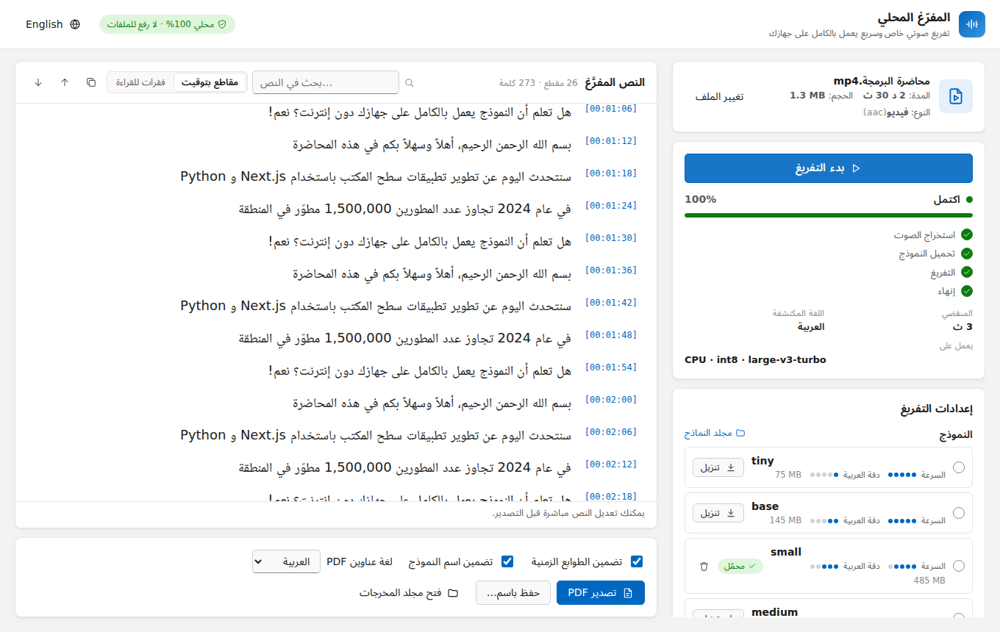
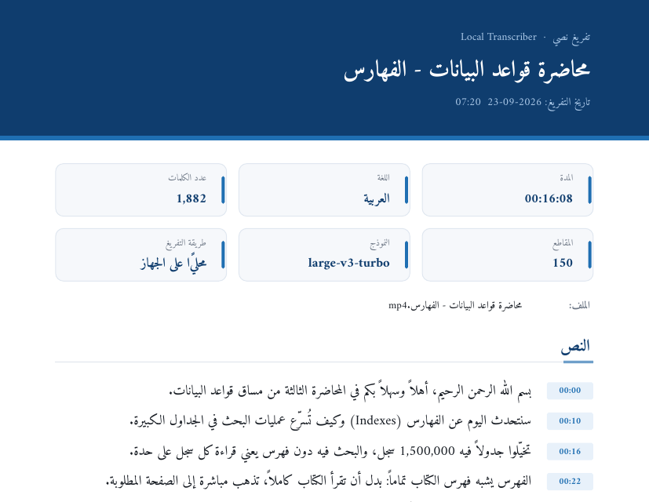

<div align="center">


# المفرّغ المحلي — Local Transcriber

**تفريغ الفيديو والصوت إلى نص على ويندوز، بخصوصية تامة ودون إنترنت، مصمَّم للعربية أولاً.**

أسقِط ملف فيديو ← يُفرَّغ **على جهازك أنت** ← عدّل النص ← صدّره ملف **PDF** عربي منسّق.

[](#المتطلبات)
[](https://nodejs.org)
[](https://www.python.org)
[](https://github.com/SYSTRAN/faster-whisper)
[](LICENSE)

[English](README.md) · **العربية**



</div>

---

## المحتويات

- [المميزات](#المميزات)
- [المتطلبات](#المتطلبات)
- [التشغيل السريع](#التشغيل-السريع)
- [طريقة الاستخدام](#طريقة-الاستخدام)
- [اختيار النموذج](#اختيار-النموذج)
- [فيديوهات يوتيوب](#فيديوهات-يوتيوب)
- [الإدخال في قاعدة بيانات](#الإدخال-في-قاعدة-بيانات)
- [دعم كرت الشاشة NVIDIA](#دعم-كرت-الشاشة-nvidia)
- [بناء ملف تثبيت لويندوز](#بناء-ملف-تثبيت-لويندوز)
- [حل المشاكل](#حل-المشاكل)
- [هيكل المشروع](#هيكل-المشروع)
- [الخصوصية](#الخصوصية)
- [الترخيص](#الترخيص)

---

## المميزات

- 🔒 **محلي 100%**: لا يُرفع أي ملف إلى الإنترنت. لا حسابات، ولا مفاتيح API، ولا اشتراكات.
- 📴 **يعمل دون إنترنت**: يُنزَّل نموذج الذكاء الاصطناعي مرة واحدة فقط، ثم يعمل كل شيء دون اتصال.
- 🇸🇦 **العربية أولاً**: واجهة من اليمين لليسار، وخطوط عربية واضحة، ونماذج تتعامل مع اللهجات، إضافة إلى نحو 99 لغة أخرى مع كشف تلقائي للغة.
- ⚡ **سريع**: يعتمد على [faster-whisper](https://github.com/SYSTRAN/faster-whisper) و CTranslate2، ويستخدم كرت شاشة NVIDIA تلقائياً عند توفره، مع معالجة دفعية وتخطٍّ للصمت.
- 🎬 **يدعم الصيغ الشائعة**: MP4 و MKV و AVI و MOV و WEBM و MP3 و WAV و M4A و FLAC وغيرها، مع السحب والإفلات.
- ✍️ **نص مباشر قابل للتعديل**: يظهر النص أثناء التفريغ، ويمكنك البحث فيه وتصحيحه والتبديل إلى وضع القراءة.
- ▶️ **روابط يوتيوب**: يستخدم ترجمة الفيديو الموجودة إن وُجدت، وإلا ينزّل الصوت فقط ويفرّغه.
- 🗄️ **الإدخال في قاعدة بياناتك**: SQL Server أو Oracle أو MySQL أو PostgreSQL، بجملة SQL تكتبها أنت.
- 📄 **تصدير PDF عربي سليم**: حروف متصلة، واتجاه صحيح من اليمين لليسار، ودعم النص المختلط (عربي وإنجليزي وأرقام)، مع خيار إظهار التوقيتات.
- 🌙 **وضع فاتح وداكن**، وواجهة بالعربية أو الإنجليزية.

<div align="center">

<br/><sub>نموذج من ملف PDF المُصدَّر</sub>
</div>

---

## المتطلبات

| | الإصدار | طريقة التثبيت |
|---|---|---|
| **ويندوز** | 10 أو 11 (64-بت) | — |
| **Node.js** | **22.12 أو أحدث** | `winget install OpenJS.NodeJS.LTS` أو من [nodejs.org](https://nodejs.org) |
| **Python** | من 3.10 إلى 3.13 (يُنصح بـ 3.12) | `winget install Python.Python.3.12` أو من [python.org](https://www.python.org/downloads/windows/). فعّل خيار **“Add python.exe to PATH”** أثناء التثبيت |
| **Git** | أي إصدار | `winget install Git.Git` |
| كرت شاشة NVIDIA | *اختياري* | يكفي تعريف NVIDIA محدَّث، ولا حاجة لتثبيت CUDA Toolkit. |

> **لا حاجة** لتثبيت FFmpeg بنفسك، فهو يُنزَّل تلقائياً أثناء التثبيت.

للتحقق من الإصدارات المثبتة:

```bash
node -v      # يجب أن يكون v22.12.0 أو أعلى
python --version
```

---

## التشغيل السريع

```bash
# 1. تنزيل المشروع
git clone https://github.com/<your-username>/windowsApplication.git
cd windowsApplication

# 2. تثبيت كل شيء (حزم JavaScript + بيئة Python + FFmpeg)
npm install

# 3. تشغيل التطبيق
npm run dev
```

بعد ثوانٍ تُفتح نافذة التطبيق.

يستغرق `npm install` بضع دقائق في المرة الأولى، لأنه يثبّت حزم JavaScript، وينشئ بيئة Python معزولة في `backend/.venv`، ويثبّت faster-whisper، ويثبّت مكتبات CUDA إذا وُجد كرت NVIDIA. أما إعادة تشغيله لاحقاً فتكون سريعة.

> 💡 **نصيحة:** يُفضَّل ألّا تضع المشروع داخل مجلد تزامنه OneDrive، لأن مجلدَي `node_modules` و `backend/.venv` كبيران وسيحاول OneDrive مزامنتهما.

---

## طريقة الاستخدام

1. **اختر ملفاً**: اسحب ملف فيديو أو صوت وأفلته داخل النافذة، أو اضغط **اختيار ملف**.
2. **اضبط الإعدادات** (الإعدادات الافتراضية مناسبة للعربية):
   - **النموذج**: راجع قسم [اختيار النموذج](#اختيار-النموذج).
   - **لغة الكلام**: العربية افتراضياً، أو اختر **كشف تلقائي**.
   - **المعالج**: في وضع *تلقائي* يُستخدم كرت الشاشة إذا كان قوياً بما يكفي، وإلا فالمعالج المركزي.
   - **الأولوية**: *الأسرع* أو *متوازن* (موصى به) أو *الأدق*.
3. اضغط **بدء التفريغ**. عند استخدام نموذج لأول مرة يُنزَّل تلقائياً مع شريط تقدم.
4. تابع النص وهو يظهر مباشرة، ويمكنك **الإلغاء** في أي وقت.
5. **عدّل** أي سطر مباشرة، أو **ابحث** في النص، أو انتقل إلى **وضع القراءة**.
6. اضغط **تصدير PDF** (أو **حفظ باسم…**)، واختر إن كنت تريد إظهار التوقيتات.
7. اضغط **فتح مجلد المخرجات** للوصول إلى ملفات PDF (المجلد الافتراضي: `Documents\Local Transcriber`).

---

## اختيار النموذج

| النموذج | الحجم | السرعة | دقة العربية | الأنسب لـ |
|---|---|---|---|---|
| `tiny` | 75 MB | ★★★★★ | ★☆☆☆☆ | التجربة السريعة |
| `base` | 145 MB | ★★★★★ | ★★☆☆☆ | الأجهزة الضعيفة جداً |
| `small` | 485 MB | ★★★★☆ | ★★★☆☆ | الأجهزة المحمولة القديمة |
| `medium` | 1.5 GB | ★★☆☆☆ | ★★★★☆ | — |
| **`large-v3-turbo`** | 1.6 GB | ★★★★☆ | ★★★★☆ | **الافتراضي على المعالج المركزي**: دقة قريبة من الأفضل وسرعة أعلى بكثير |
| **`large-v3`** | 3.1 GB | ★☆☆☆☆ | ★★★★★ | **الافتراضي على كرت شاشة بذاكرة 6 GB أو أكثر**: أفضل دقة للعربية واللهجات |

- يُنزَّل كل نموذج **مرة واحدة فقط** ويُحفظ في مجلد `models/`، ثم يعمل دون إنترنت.
- يمكنك تنزيل النموذج مسبقاً بزر **تنزيل** بجانبه، أو حذفه بأيقونة 🗑️.
- إذا كان التفريغ بطيئاً على جهازك، جرّب نموذج `small` مع أولوية **الأسرع**.

---

## فيديوهات يوتيوب

الصق رابط فيديو يوتيوب في الحقل تحت منطقة السحب والإفلات (أو الصقه فقط، فيُجلب تلقائياً):

- **إذا كان للفيديو ترجمة على يوتيوب** تظهر لك قائمة بها: ترجمة صاحب القناة أولاً (الأدق عادةً)، ثم ترجمة يوتيوب التلقائية. اضغط **استخدام** فيظهر النص فوراً مع التوقيتات، دون نموذج ودون تنزيل.
- **إذا لم تكن له ترجمة** يخبرك التطبيق أنه سيُنشئها: اختر النموذج والإعدادات كالمعتاد واضغط **بدء التفريغ**. يُنزَّل **الصوت فقط** (نحو 1 MB لكل دقيقة)، ثم يُفرَّغ محلياً مثل أي ملف.
- يمكنك دائماً تجاهل الترجمة الموجودة والضغط على **بدء التفريغ** لاستخدام Whisper.

كل الميزات الأخرى (التعديل، وتصدير PDF، والإدخال في قاعدة بيانات) تعمل بنفس الطريقة.

> يوتيوب يتغيّر كثيراً. إذا توقفت الروابط عن العمل فجأة، نفّذ `npm run update:youtube` لتحديث أداة يوتيوب ([yt-dlp](https://github.com/yt-dlp/yt-dlp)). فرّغ فقط الفيديوهات التي يحق لك استخدامها.

---

## الإدخال في قاعدة بيانات

بعد التفريغ اضغط **إدخال في قاعدة بيانات** لإضافة النص مباشرة إلى قاعدة بياناتك (**SQL Server أو Oracle أو MySQL/MariaDB أو PostgreSQL**) بجملة SQL تكتبها أنت.

1. اختر نوع القاعدة، والصق **سلسلة الاتصال** (Connection string)، ثم اضغط **اختبار الاتصال**.

   | القاعدة | مثال على سلسلة الاتصال |
   |---|---|
   | SQL Server | `Server=myserver,1433;Database=MyDb;User Id=myuser;Password=mypassword;TrustServerCertificate=True;` |
   | Oracle | `myuser/mypassword@myhost:1521/ORCLPDB1` |
   | MySQL / MariaDB | `Server=myhost;Port=3306;Database=mydb;Uid=myuser;Pwd=mypassword;` |
   | PostgreSQL | `Host=myhost;Port=5432;Database=mydb;Username=myuser;Password=mypassword` |

2. اختر **شكل الإدخال**: صف لكل مقطع بطول N ثانية، أو صف لكل مقطع كما خرج من Whisper، أو صف واحد للنص كاملاً.
3. أضف **متغيراتك** إن احتجت، مثل `lesson_id = 42`.
4. اكتب الجملة واستخدم المتغيرات بعلامة `@` (أو `:` في Oracle):

   ```sql
   -- اختيارية: تُنفَّذ مرة واحدة قبل الإدخال
   DELETE FROM LessonTranscripts WHERE LessonId = @lesson_id;

   -- تُنفَّذ لكل صف
   INSERT INTO LessonTranscripts (LessonId, StartSeconds, EndSeconds, [Text])
   VALUES (@lesson_id, @start_seconds, @end_seconds, @text);
   ```

5. اضغط **معاينة** لترى أول الصفوف، ثم **تنفيذ الإدخال** وأكّد.

**المتغيرات المتاحة**

| لكل صف | للملف كاملاً |
|---|---|
| `text` و `start_seconds` و `end_seconds` و `start_time` و `end_time` و `segment_index` | `file_name` و `file_path` و `language` و `model` و `duration_seconds` و `segment_count` و `full_text` و `transcribed_at` |

- تُرسل القيم كـ **parameters** ولا تُدمج في نص الجملة، لذلك النص العربي وعلامات الاقتباس و `%` آمنة دائماً، ولا يوجد خطر SQL injection.
- كل شيء يُنفَّذ داخل **transaction واحدة**: إذا فشل أي صف لا يُدخل شيء، بما في ذلك جملة «قبل الإدخال».
- يمكنك حفظ الإعدادات (الاتصال والجملة). سلسلة الاتصال **مشفّرة بتشفير ويندوز (DPAPI)** ومحفوظة على جهازك فقط.
- مكتبات الاتصال تُثبَّت تلقائياً مع `npm install` أو `npm run setup`، ولا حاجة لتثبيت أي برنامج قاعدة بيانات. لاستخدام SQL Server بـ *مصادقة ويندوز* (`Integrated Security=True`) ثبّت «ODBC Driver 18 for SQL Server» من مايكروسوفت.

---

## دعم كرت الشاشة NVIDIA

يتعرّف التطبيق على كرت الشاشة تلقائياً:

- **كرت مناسب** (ذاكرة 4 GB أو أكثر، من سلسلة GTX 10 أو أحدث): يستخدمه الوضع *التلقائي*، وهو عادةً أسرع من المعالج المركزي بعدة مرات. الكروت ذات 6 GB أو أكثر تستخدم `large-v3` افتراضياً، والأصغر تستخدم `large-v3-turbo`.
- **كرت ضعيف** (مثل GeForce MX110 أو MX130 أو MX150 بذاكرة 2 GB): يستخدم الوضع *التلقائي* **المعالج المركزي** لأنه أسرع وأكثر استقراراً مع هذه الكروت، ويبقى بإمكانك اختيار GPU يدوياً مع النماذج الصغيرة.
- **لا يوجد كرت NVIDIA** (كروت AMD أو Intel): يُستخدم المعالج المركزي.

إذا فشل كرت الشاشة لأي سبب، ينتقل التطبيق تلقائياً إلى المعالج المركزي ويُظهر تنبيهاً بذلك.

أوامر مفيدة:

```bash
npm run doctor      # يعرض حالة Python و FFmpeg وكرت الشاشة و CUDA
npm run setup:gpu   # تثبيت (أو إعادة تثبيت) مكتبات CUDA/cuDNN من NVIDIA
npm run setup:cpu   # بيئة للمعالج المركزي فقط
```

---

## بناء ملف تثبيت لويندوز

نفّذ الأمر التالي على ويندوز:

```bash
npm run dist
```

ينتج عنه الملف `release/LocalTranscriber-Setup-<version>.exe`، وهو ملف تثبيت ويندوز عادي. من يثبّته **لا يحتاج** إلى Node.js أو Python أو FFmpeg.

| الأمر | النتيجة |
|---|---|
| `npm run dist` | ملف تثبيت كامل (`.exe`) داخل مجلد `release/` |
| `npm run pack` | نسخة غير مضغوطة في `release/win-unpacked/` للتجربة السريعة |
| `npm run build` | بناء الواجهة والخادم فقط |

> إذا كان في جهاز البناء كرت NVIDIA، تُضمَّن مكتبات CUDA في ملف التثبيت (بزيادة نحو 800 MB) ليعمل تسريع كرت الشاشة عند المستخدمين. للحصول على ملف تثبيت أصغر للمعالج المركزي فقط، نفّذ `npm run setup:cpu` في نسخة جديدة من المشروع قبل `npm run dist`.

بعد التثبيت يحفظ التطبيق النماذج في `%LOCALAPPDATA%\Local Transcriber\models`، والسجلات في `%APPDATA%\Local Transcriber\logs`.

---

## حل المشاكل

| المشكلة | الحل |
|---|---|
| تحذيرات `EBADENGINE` أو Electron لا يعمل | إصدار Node.js أقدم من 22.12. ثبّت Node 22 LTS، واحذف مجلد `node_modules`، ثم نفّذ `npm install` من جديد. |
| رسالة «بيئة Python غير مثبتة» | ثبّت Python 3.12 (مع خيار *Add to PATH*)، ثم نفّذ `npm run setup`. |
| `'npm' is not recognized` | ثبّت Node.js، ثم افتح نافذة أوامر **جديدة**. |
| رسالة «لم يُعثر على FFmpeg» | نفّذ `npm install` مرة أخرى. |
| فشل تنزيل النموذج | الإنترنت مطلوب في المرة الأولى فقط. تحقّق من الاتصال أو إعدادات البروكسي وأعد المحاولة، وسيُستكمل التنزيل من حيث توقف. |
| رسالة «الذاكرة غير كافية» أو بطء على جهاز محمول | يعمل التطبيق تلقائياً بوضع موفّر للذاكرة عندما تكون الذاكرة قليلة. لسرعة أكبر أغلق المتصفح والبرامج الأخرى، واستخدم `npm run app` بدل `npm run dev`، لأن خادم التطوير وحده يستهلك مئات الميغابايت. |
| كرت الشاشة لا يُستخدم | حدّث تعريف NVIDIA، ثم نفّذ `npm run setup:gpu` ثم `npm run doctor`. |
| رسالة «لم يُكتشف أي كلام» | الملف لا يحتوي على كلام مسموع (موسيقى أو صمت)، أو لا يحتوي على مسار صوتي. |
| تعذّر حفظ ملف PDF | أغلق ملف PDF إن كان مفتوحاً في برنامج آخر، ثم صدّره مجدداً. |
| رابط يوتيوب لا يعمل أو رسالة «تأكيد أنك لست روبوتاً» | نفّذ `npm run update:youtube`، وانتظر قليلاً ثم أعد المحاولة. الفيديوهات الخاصة وفيديوهات الأعضاء والمقيّدة بالعمر لا يمكن جلبها. |
| أي مشكلة أخرى | راجع ملف السجل `%APPDATA%\Local Transcriber\logs\backend.log` ونفّذ `npm run doctor`. |

---

## هيكل المشروع

```
windowsApplication/
├── electron/          # غلاف تطبيق ويندوز (النافذة، الحوارات، تشغيل الخادم)
├── frontend/          # واجهة المستخدم: Next.js + React + TypeScript
├── backend/           # Python: faster-whisper و FFmpeg وتصدير PDF (خادم محلي فقط)
├── scripts/           # سكربتات Node تستخدمها أوامر npm (الإعداد، التشغيل، البناء، الفحص)
├── models/            # نماذج الذكاء الاصطناعي المنزَّلة (لا تُرفع إلى git)
├── build/             # أيقونات التطبيق
├── docs/              # لقطات الشاشة والتوثيق التقني
└── package.json       # جميع الأوامر: التثبيت، التشغيل، البناء
```

لمعرفة طريقة العمل الداخلية (المعمارية، ونموذج الأمان، والأداء) راجع **[docs/ARCHITECTURE.md](docs/ARCHITECTURE.md)** (بالإنجليزية).

### جميع أوامر npm

| الأمر | الوظيفة |
|---|---|
| `npm install` | يثبّت كل شيء (وينفّذ `npm run setup` تلقائياً) |
| `npm run dev` | يشغّل التطبيق في وضع التطوير (تحديث فوري عند تعديل الكود) |
| `npm run app` | يبني الواجهة مرة واحدة ثم يشغّل التطبيق: استهلاك ذاكرة أقل، والأنسب للاستخدام اليومي |
| `npm run setup` | يعيد إنشاء بيئة Python أو يصلحها |
| `npm run doctor` | يعرض تقريراً تشخيصياً |
| `npm run update:youtube` | يحدّث أداة يوتيوب (yt-dlp) |
| `npm run dist` | يبني ملف تثبيت ويندوز |
| `npm run typecheck` | فحص أنواع TypeScript |

---

## الخصوصية

- ملفاتك **تُقرأ من جهازك فقط** ولا تُرفع إلى أي مكان.
- النصوص وملفات PDF تبقى على جهازك.
- لا إحصاءات، ولا تتبّع، ولا حسابات، ولا مفاتيح API.
- يُستخدم الإنترنت فقط لتنزيل النموذج مرة واحدة من [Hugging Face Hub](https://huggingface.co/Systran) العام، وعندما **تلصق أنت** رابط يوتيوب لجلب ترجمة ذلك الفيديو أو صوته.
- الخادم الداخلي يستمع على `127.0.0.1` فقط، ومحميّ برمز عشوائي يتغير مع كل تشغيل.

---

## الترخيص

[MIT](LICENSE) © 2026

بُني باستخدام [faster-whisper](https://github.com/SYSTRAN/faster-whisper) و [CTranslate2](https://github.com/OpenNMT/CTranslate2) ونماذج [OpenAI Whisper](https://github.com/openai/whisper) و [Next.js](https://nextjs.org) و [Electron](https://www.electronjs.org) و [FFmpeg](https://ffmpeg.org) و [fpdf2](https://github.com/py-pdf/fpdf2).
الخطوط: [Amiri](https://github.com/aliftype/amiri) و Noto Sans Arabic و Noto Naskh Arabic، بترخيص SIL Open Font License 1.1.
