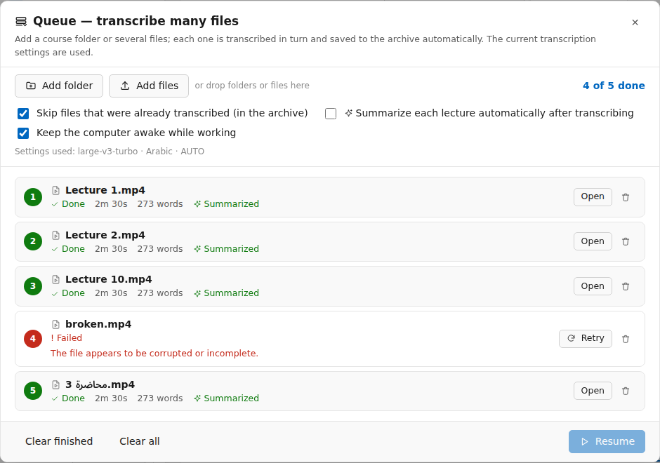
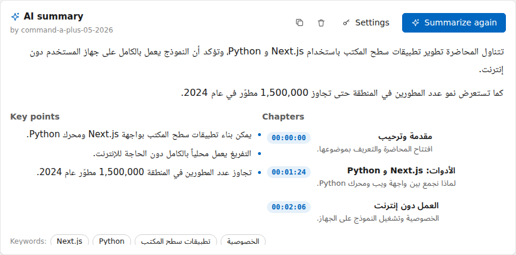
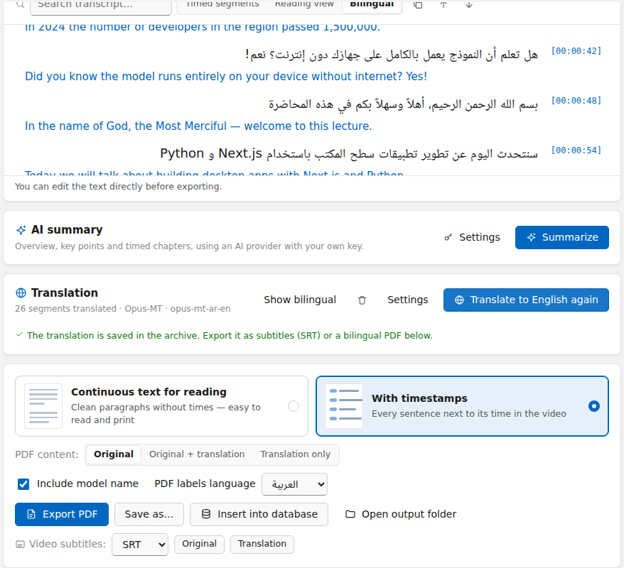

<div align="center">


# Local Transcriber

**Private, offline video & audio transcription for Windows — built for Arabic first.**

Drop a video → it's transcribed **on your own PC** → edit the text → export a clean Arabic **PDF**.

[](#requirements)
[](https://nodejs.org)
[](https://www.python.org)
[](https://github.com/SYSTRAN/faster-whisper)
[](LICENSE)

**English** · [العربية](README.ar.md)


</div>

---

## Table of contents

- [Features](#features)
- [Requirements](#requirements)
- [Quick start](#quick-start)
- [Sign-in](#sign-in)
- [How to use](#how-to-use)
- [Choosing a model](#choosing-a-model)
- [Paid providers (Cohere, OpenAI, Groq)](#paid-providers-cohere-openai-groq)
- [Archive](#archive)
- [Batch queue (whole folders)](#batch-queue-whole-folders)
- [AI summary & chapters](#ai-summary--chapters)
- [Ask the course](#ask-the-course)
- [Translation & subtitles](#translation--subtitles)
- [Player, exports & video with subtitles](#player-exports--video-with-subtitles)
- [YouTube videos](#youtube-videos)
- [Insert into a database](#insert-into-a-database)
- [GPU (NVIDIA) support](#gpu-nvidia-support)
- [Build a Windows installer](#build-a-windows-installer)
- [Troubleshooting](#troubleshooting)
- [Project structure](#project-structure)
- [Privacy](#privacy)
- [License](#license)

---

## Features

- 🔒 **100% local by default** — with local Whisper your files are never uploaded. No accounts, no API keys, no subscriptions.
- 📴 **Works offline** — the AI model is downloaded once, then everything runs without internet.
- 🇸🇦 **Arabic first** — right-to-left interface, Arabic typography, dialect-friendly models, and ~99 other languages with auto-detection.
- ⚡ **Fast** — [faster-whisper](https://github.com/SYSTRAN/faster-whisper) + CTranslate2, automatic NVIDIA GPU acceleration, batched decoding, silence skipping.
- 🎬 **Any common format** — MP4, MKV, AVI, MOV, WEBM, MP3, WAV, M4A, FLAC and more (drag & drop supported).
- ✍️ **Live, editable transcript** — see text appear in real time, search it, fix it, switch to a reading view.
- ☁️ **Optional paid providers** — Cohere Transcribe, OpenAI or Groq with your own API key.
- 🗂️ **Archive** — every transcript saved automatically, searchable, reopenable.
- 📚 **Batch queue** — add a whole course folder and let it transcribe overnight, one file after another, straight into the archive.
- 🌐 **Translation & subtitles** — Arabic → English for free on your PC, or with DeepL / Azure / your AI key; bilingual view, SRT/VTT subtitles and a bilingual PDF.
- ✨ **AI summary & chapters** — overview, key points and timed chapters with your own Claude / OpenAI / Cohere / Groq key (text only is sent).
- 💬 **Ask the course** — ask a question about a whole course and get the answer with the lesson and minute.
- 🎞️ **Player synced with the text** — click any sentence to play from there; the current sentence is highlighted. Plus a **video with the subtitles burned in**, ready for YouTube or Instagram.
- 🌍 **Course website** — export a course as a small offline website (a page per lesson, search across the course), plus Word, text and JSON exports.
- 📊 **Statistics** — hours transcribed, per course and per month, and what still lacks a summary or translation.
- ▶️ **YouTube links** — uses the video's existing captions when available, otherwise downloads only the audio and transcribes it.
- 🗄️ **Insert into your database** — SQL Server, Oracle, MySQL or PostgreSQL, with your own SQL statement.
- 📄 **Proper Arabic PDF export** — connected letters, correct RTL order, mixed Arabic/English and numbers, optional timestamps.
- 🌙 **Light & dark mode**, Arabic / English interface.

<div align="center">

<br/><sub>Sample of the exported PDF</sub>
</div>

---

## Requirements

| | Version | How to install |
|---|---|---|
| **Windows** | 10 or 11 (64-bit) | — |
| **Node.js** | **22.12 or newer** | `winget install OpenJS.NodeJS.LTS` or [nodejs.org](https://nodejs.org) |
| **Python** | 3.10 – 3.13 (3.12 recommended) | `winget install Python.Python.3.12` or [python.org](https://www.python.org/downloads/windows/) — tick **“Add python.exe to PATH”** |
| **Git** | any | `winget install Git.Git` |
| NVIDIA GPU | *optional* | Just an up-to-date NVIDIA driver. No CUDA Toolkit needed. |

> FFmpeg is **not** needed separately — it is downloaded automatically during installation.

Check your versions:

```bash
node -v      # must be v22.12.0 or higher
python --version
```

---

## Quick start

```bash
# 1. Get the code
git clone https://github.com/<your-username>/windowsApplication.git
cd windowsApplication

# 2. Install everything (JavaScript + Python environment + FFmpeg)
npm install

# 3. Run the app
npm run dev
```

That's it. The app window opens after a few seconds.

`npm install` takes a few minutes the first time: it installs the JavaScript packages, creates a Python virtual environment in `backend/.venv`, installs faster-whisper, and — if an NVIDIA GPU is detected — the CUDA libraries. Running it again later is fast.

> 💡 **Tip:** avoid keeping the project inside a OneDrive-synced folder — `node_modules` and `backend/.venv` are large and OneDrive will try to sync them.

---

## Sign-in

The app opens on a **sign-in screen** with two tabs: **Sign in** and **Create account**. Accounts live in the central service **WindowsAppLoginBackend** (a separate ASP.NET Core project; see its README): `auth-config.json` → `apiBaseUrl` points at it (`http://localhost:5080` while developing; set the published address before building the installer). The first account created becomes the administrator. **Remember me on this computer** keeps you signed in (encrypted with Windows DPAPI) until the token expires, and the session is re-checked with the service at each launch, so a disabled account or a changed password signs the app out; without internet the remembered session keeps working. **Sign out** is in the top bar.

The lock is in Electron's main process: until sign-in succeeds the window gets no connection to the local transcription engine and no saved keys, so hiding the screen doesn't unlock anything. `"enabled": false` in `auth-config.json` switches sign-in off in development only — an installed copy always asks. Only the sign-in request uses the internet; transcription stays local.

---

## How to use

1. **Choose a file** — drag & drop a video/audio file onto the window, or click **Choose File**.
2. **Pick settings** (the defaults are fine for Arabic):
   - **Model** — see [Choosing a model](#choosing-a-model).
   - **Spoken language** — Arabic by default, or **Auto Detect**.
   - **Device** — *Auto* uses the GPU when it's strong enough, otherwise the CPU.
   - **Priority** — *Fastest*, *Balanced* (recommended) or *Most accurate*.
3. Click **Start Transcription**. The first time you use a model it is downloaded automatically (progress is shown).
4. Watch the transcript appear live. You can **cancel** at any time.
5. **Edit** any line directly, **search** the text, or switch to the **Reading view**.
6. Click **Export PDF** (or **Save as…**). Choose whether to include timestamps.
7. Use **Open output folder** to find your PDFs (default: `Documents\Local Transcriber`).

---

## Choosing a model

| Model | Size | Speed | Arabic accuracy | Best for |
|---|---|---|---|---|
| `tiny` | 75 MB | ★★★★★ | ★☆☆☆☆ | Quick tests |
| `base` | 145 MB | ★★★★★ | ★★☆☆☆ | Very weak PCs |
| `small` | 485 MB | ★★★★☆ | ★★★☆☆ | Older laptops |
| `medium` | 1.5 GB | ★★☆☆☆ | ★★★★☆ | — |
| **`large-v3-turbo`** | 1.6 GB | ★★★★☆ | ★★★★☆ | **Default on CPU** — near-best accuracy, much faster |
| **`large-v3`** | 3.1 GB | ★☆☆☆☆ | ★★★★★ | **Default on a GPU with 6 GB+** — best Arabic & dialects |
| `Cohere Transcribe Arabic` *(experimental)* | 1.5 GB | ★★★★☆ | ★★★★★ | Arabic lectures and dialects, on the CPU |

**Cohere Transcribe Arabic (experimental):** Cohere's open-weights (Apache 2.0) Arabic model — Modern Standard Arabic, Egyptian, Gulf, Levantine and Maghrebi dialects, and Arabic-English code-switching. On the Hugging Face Arabic ASR leaderboard its word error rate is about 26% vs 37% for Whisper large-v3. It runs locally on the CPU (4-bit ONNX, about 2.4 GB of RAM) with ONNX Runtime in a separate worker process; on a 2-core CPU it measured about 6× faster than `large-v3-turbo` with the same transcript. The published graph files have errors that stop them from loading, so the app ships repaired copies (`backend/assets/cohere`, made with `scripts/tools/repair_cohere_onnx.py`) and puts them next to the downloaded weights automatically. Limits: Arabic and English only (no language auto-detection), no GPU, no timestamps from the model itself — each segment's timing comes from the speech pauses (segments up to 20 s) — and no custom vocabulary.

- Each model is downloaded **once** and stored in the `models/` folder. After that it works offline.
- You can pre-download a model with its **Download** button, or delete it with the 🗑️ icon.
- If transcription is slow on your PC, try `small` with the **Fastest** priority.
- **Custom vocabulary** (Settings → *Custom vocabulary*): list names and technical terms separated by commas (e.g. `PostgreSQL, SELECT, د. أحمد`). The model is nudged to spell them correctly — useful for course names, teachers and English terms inside Arabic lectures. It also applies to OpenAI and Groq.
- **Speed tricks that are automatic:** the model loads while the audio is still being extracted, and in the queue the next file's audio is prepared while the current one is transcribed, so there is almost no waiting between files.

---

## Paid providers (Cohere, OpenAI, Groq)

Besides local Whisper, you can transcribe with a paid cloud provider using **your own API key**. Billing is directly between you and the provider — the app never handles payment.

| Provider | Models | Notes |
|---|---|---|
| **Cohere Transcribe** | `cohere-transcribe-arabic-07-2026` (Arabic), `cohere-transcribe-03-2026` (14 languages) | Requires choosing the spoken language (no auto-detect) |
| **OpenAI** | `gpt-4o-transcribe`, `gpt-4o-mini-transcribe`, `whisper-1` | |
| **Groq** | `whisper-large-v3-turbo`, `whisper-large-v3` | Very fast |

1. In **Transcription settings → Transcription engine**, choose **Paid provider**.
2. Pick the provider and model, paste your API key, click **Test** (a free check — nothing is transcribed).
3. Choose the spoken language and click **Start Transcription** as usual.

- The key is stored **encrypted with Windows DPAPI** on your PC and is sent only to that provider.
- Only the **speech parts** of the audio are uploaded (silence is skipped), as short chunks sent in parallel. Each chunk's position in the original file gives the timestamps — even for providers that return none — and no file-size limit is ever hit.
- When a paid provider is selected, the header shows **“Cloud: audio is uploaded to …”** so it's always clear where your audio goes.

---

## Archive

Every transcript is saved automatically in a local archive — files, YouTube links, local Whisper or paid providers — and your edits are saved too.

- Click **Archive** in the top bar to browse, **search** (titles and text; Arabic diacritics and letter variants are ignored), **open** or **delete** transcripts.
- An opened transcript can be edited, exported to PDF or inserted into a database like a new one.
- **Whole course at once:** select a course and click
  - **Insert course into database** — every lesson is inserted with a saved database profile (each lesson in its own transaction). Extra per-lesson variables: `@lesson_index` (its number in the course, by title order), `@lesson_title`, `@course`, `@youtube_id`. **Preview** shows the rows of the first lesson first.
  - **Export course** — one folder with `01 - Lesson.pdf`, `01 - Lesson.ar.srt`, `01 - Lesson.en.srt`… per lesson (PDF layout, content and subtitle format are yours to choose) plus an `index.csv` listing every lesson — ready to upload to your platform.
- **Courses:** a folder or a YouTube playlist added to the queue becomes a course automatically (the folder name / playlist title). The archive's side list shows every course with its count; rename a course, or put any transcript in a course (or take it out) from its row. Searching also matches course names.
- **Statistics:** the **Statistics** button shows hours transcribed (total, per month and per course) and, per course, how many lessons still have no summary or translation. Click a course to open it.
- **Course website:** in **Export course**, tick **Mini website for the course** to get a `website` folder: `index.html` lists the lessons and searches the whole course (Arabic-insensitive), and each lesson page has the summary, clickable chapters, the text and the translation behind a button, plus links to the lesson's PDF/Word/subtitles. It works straight from the folder without internet, or uploaded to any hosting. The same dialog can also add **Word**, **plain text** and **JSON** files per lesson.
- **Backup & move to another PC:** **Back up** saves the whole archive — transcripts, edits, summaries, translations and courses — to one `.ltbackup` file. On the other computer, open the archive and click **Restore**: entries are merged (new ones added, nothing deleted, and an entry edited more recently on that computer is kept). API keys and database passwords are *not* included, because they are encrypted for each computer.
- The archive is a SQLite file in `%APPDATA%\Local Transcriber\archive.db` and never leaves your PC.

---

## Batch queue (whole folders)

Transcribe a whole course without clicking **Start** for every lecture:

1. Click **Queue** in the top bar — or, on the main screen, **Whole folder** / **Several videos**, or drop several files or a folder onto the drop area.
2. Click **Add folder** (sub-folders are included) or **Add files** — or drop folders/files onto the window. Files are ordered naturally (`Lecture 2` before `Lecture 10`); you can reorder or remove them.
3. Click **Start**. Files are transcribed one after another with the **current transcription settings** (model, language, local or paid provider), and every finished transcript is **saved to the archive**.

<div align="center"></div>

**YouTube playlists:** paste a playlist link in the queue's YouTube field (or in the main YouTube field — the app offers to add the whole playlist) and every video is added. For each video the app uses **YouTube's captions** when they exist in the transcription language (channel captions first, then automatic ones) — instant, no download — and otherwise downloads only the audio and transcribes it. Each row shows which way it went. Private/deleted videos are skipped, and videos already in the archive are skipped too, so re-adding the playlist later picks up only new lessons.

Options:

- **Skip files already transcribed** — files already in the archive aren't added again, so you can re-add the same folder after new lectures appear.
- **Summarize each lecture automatically** — runs the AI summary (below) after each transcript.
- **Insert each lecture into the database** — with a saved profile, right after its transcript (and translation / summary, if enabled) is ready. Put a course folder in the queue at night and find it on your website in the morning.
- **Keep the computer awake** — Windows won't go to sleep while the queue runs (the screen may still turn off).

A file that fails (e.g. a damaged video) is marked **Failed** with the reason and a **Retry** button; the queue continues with the next file. It only pauses when every remaining file would fail the same way (invalid API key, no credit, model can't be downloaded). **Stop after current file** finishes the running file first; **Stop now** cancels it. The top-bar button shows progress (e.g. `3/12`) while you keep working.

**If the app closes before the queue finishes** (you close it, Windows restarts, a power cut), the queue is not lost: the next time you open the app a notice says how many files are left, and **Continue where it stopped** carries on (the file that was interrupted is done again from the start). Only the file list and results are saved — never API keys or database passwords.

---

## AI summary & chapters

At the bottom of the page (after the export options), **AI summary** creates:

- a short **summary** of the whole recording,
- the **key points** (ideas, definitions, conclusions),
- **chapters** that follow the real topic changes, each with its start time — click a chapter to jump to it in the transcript,
- keywords.

It uses a large language model from a provider you choose, with **your own API key** (billing is between you and the provider):

| Provider | Default models |
|---|---|
| **Anthropic (Claude)** | `claude-sonnet-5`, `claude-haiku-4-5-20251001`, `claude-opus-5-5` |
| **OpenAI** | `gpt-5.4-mini`, `gpt-5.4`, `gpt-5-mini` |
| **Cohere** | `command-a-plus-05-2026`, `command-a-03-2025` |
| **Groq** | `openai/gpt-oss-120b`, `llama-3.3-70b-versatile` |

<div align="center"></div>

Choose **Other model…** to type any model name from the provider's docs. The summary can be written in the transcript's language, Arabic or English.

- **Only the transcript text** is sent — never audio or video — and only when you click **Summarize** (or enable it for a batch).
- Long lectures are split into parts, summarized, then merged, so any length works.
- The summary is saved with the transcript in the archive.
- In the PDF (option **Include the summary and chapters**) it appears before the transcript, the chapter list is clickable, and each chapter becomes a heading and a PDF bookmark inside the transcript.
- Keys are shared with the paid transcription providers and stored encrypted (Windows DPAPI).

> AI summaries can contain mistakes — review them before relying on them.


**Free built-in key:** the app can ship a Groq key so summaries and "Ask the course" work without any setup (default model `openai/gpt-oss-120b`). Put it in `builtin-keys.json` at the project root — `{"cloud:groq": "gsk_…"}` — it is ignored by git and copied into the installer. A key the user saves in the settings always takes priority. Note that anyone who has the installer can extract that key, and all users share its Groq limits.
---

## Ask the course

It uses the same AI provider and key as the [AI summary](#ai-summary--chapters) — only text is sent.

**Ask the course** — open a course in the archive and click **Ask the course**. Type a question (e.g. *“Where are table joins explained?”*); the answer comes only from that course's transcripts, with citations like `Lesson 3 · 12:40` — click one to open that lesson at that minute. For big courses, the most relevant passages are picked on your PC first, so the question stays small and cheap.

---

## Translation & subtitles

Translation stays hidden until you want it: click **Translation** in the transcript's toolbar to open it. It translates every sentence **with its time**, so you get:

- a **bilingual view** of the transcript (both lines are editable),
- **video subtitle files** — `SRT` or `VTT`, for the original or the translation (e.g. `lecture.en.srt`, ready to upload to YouTube or a course platform). Long sentences are split into readable subtitles of at most 2 lines,
- a **bilingual PDF** — choose **Original**, **Original + translation** or **Translation only**,
- the translation is saved in the archive, and the **batch queue** can translate every lecture automatically.

<div align="center"></div>

Choose the method:

| Method | Cost | Notes |
|---|---|---|
| **Free, on this PC** | Free | Offline. Arabic → English with [Opus-MT](https://huggingface.co/Helsinki-NLP/opus-mt-ar-en) (~150 MB, downloaded once). Fair quality — good for general understanding, weaker with dialect and rare terms |
| **AI with your key** | Paid by you (usually cents per lecture) | Claude / OpenAI / Cohere / Groq — the same keys as AI summaries. Best quality: understands context and technical terms and fixes recognition mistakes |
| **DeepL** | Free monthly allowance, then paid | Excellent quality. A free-plan key ends with `:fx`. **Test** shows this month's usage |
| **Azure AI Translator** | Free monthly allowance (F0), then paid | Enter your resource's region (e.g. `westeurope`) unless it is a global resource |

Only the transcript **text** is sent to online methods — never audio or video. The target language can be English or Arabic (e.g. to translate an English lecture into Arabic with an online method).

---

## Player, exports & video with subtitles

- **Player:** click **Player** above the transcript (or any `[00:12]` time) to play the file inside the app. The sentence being spoken is highlighted and the text follows it (turn off **Follow text** to read freely); clicking a time, a chapter or a paragraph in the reading view jumps there. Speed 0.75×–2×; `Ctrl+Space` plays/pauses and `Ctrl+←/→` skips 5 seconds. Transcripts of YouTube videos use YouTube's own player (internet needed). A format Chromium can't play (e.g. some AVI/WMV files) offers to open the file in your default player instead.
- **Other formats:** next to the PDF, **Word**, **Plain text** and **JSON** use the same options (reading or timed, original/translation/both, summary and chapters). The Word file is right-to-left for Arabic, with real headings (chapters show in Word's navigation pane). JSON has every sentence with its times, the translation and the summary — handy for your own website or scripts.
- **Video with subtitles:** **Video with subtitles** writes a *new* MP4 with the text drawn on the picture — original, translation, or both (the translation smaller, in yellow, under the original). Choose the font size and a dark box or outline. It runs on your PC with FFmpeg; expect roughly half the video's length or more. The original video is never changed.

---

## YouTube videos

Paste a YouTube link in the field under the drop zone (or just paste it — it is fetched automatically):

- **If the video has captions on YouTube**, they are listed — captions uploaded by the channel first (usually the most accurate), then YouTube's automatic captions. Click **Use** and the transcript appears instantly, with timestamps — no model and no download needed.
- **If it has no captions**, the app tells you it will create them: choose the model and settings as usual and click **Start Transcription**. Only the **audio** is downloaded (about 1 MB per minute), then it is transcribed locally like any file.
- You can always ignore existing captions and click **Start Transcription** to use Whisper instead.

Everything else — editing, PDF export, inserting into a database — works the same.

> YouTube changes often. If links suddenly stop working, run `npm run update:youtube` to update the YouTube tool ([yt-dlp](https://github.com/yt-dlp/yt-dlp)). Only transcribe videos you have the right to use.

---

## Insert into a database

After transcribing, click **Insert into database** to write the transcript straight into your own database — **SQL Server, Oracle, MySQL/MariaDB or PostgreSQL** — with an SQL statement you write yourself.

1. Choose the database type and paste your **connection string**, then click **Test connection**.

   | Database | Example connection string |
   |---|---|
   | SQL Server | `Server=myserver,1433;Database=MyDb;User Id=myuser;Password=mypassword;TrustServerCertificate=True;` |
   | Oracle | `myuser/mypassword@myhost:1521/ORCLPDB1` |
   | MySQL / MariaDB | `Server=myhost;Port=3306;Database=mydb;Uid=myuser;Pwd=mypassword;` |
   | PostgreSQL | `Host=myhost;Port=5432;Database=mydb;Username=myuser;Password=mypassword` |

2. Choose the **insert shape**: one row per ~N-second chunk, one row per Whisper segment, or one row for the whole transcript.
3. Add **your own variables** if needed (e.g. `lesson_id = 42`).
4. Write the statement using variables with `@` (or `:` for Oracle):

   ```sql
   -- optional, runs once before the inserts
   DELETE FROM LessonTranscripts WHERE LessonId = @lesson_id;

   -- runs once per row
   INSERT INTO LessonTranscripts (LessonId, StartSeconds, EndSeconds, [Text])
   VALUES (@lesson_id, @start_seconds, @end_seconds, @text);
   ```

5. Click **Preview** to see the first rows, then **Run insert** and confirm.

**Available variables**

| Per row | Per file |
|---|---|
| `text`, `start_seconds`, `end_seconds`, `start_time`, `end_time`, `segment_index` | `file_name`, `file_path`, `language`, `model`, `duration_seconds`, `segment_count`, `full_text`, `transcribed_at` |

**Translation, AI summary and course** (sent as `NULL` when not available):

| Per row | Per file |
|---|---|
| `translation` — the translated text of the same time range, `text_en` — the same when the translation is English | `full_translation`, `full_text_en`, `translation_language`, `summary`, `key_points` (one per line), `chapters` (`00:05:12 Title` per line), `chapters_json`, `keywords` (comma-separated), `course` |

Example — Arabic text and English subtitles in one table:

```sql
INSERT INTO LessonTranscripts (LessonId, StartSeconds, TextAr, TextEn)
VALUES (@lesson_id, @start_seconds, @text, @text_en);
```

- Values are sent as **bound parameters**, never pasted into the SQL, so Arabic text, quotes and `%` are always safe (no SQL injection).
- Everything runs in **one transaction**: if any row fails, nothing is inserted (including the “before” statement).
- Profiles (connection + SQL) can be saved. The connection string is **encrypted with Windows DPAPI** and stored only on your PC.
- Drivers are installed automatically by `npm install` / `npm run setup` — no database client is needed. For SQL Server with *Windows authentication* (`Integrated Security=True`), install Microsoft's “ODBC Driver 18 for SQL Server”.

---

## GPU (NVIDIA) support

The app detects your GPU automatically:

- **Capable GPU** (4 GB+ VRAM, GTX 10-series or newer): *Auto* uses it — typically many times faster than the CPU. Cards with 6 GB+ default to `large-v3`, smaller ones to `large-v3-turbo`.
- **Entry-level GPU** (e.g. GeForce MX110/MX130/MX150 with 2 GB): *Auto* uses the **CPU**, which is faster and more stable on these cards. You can still select GPU manually for small models.
- **No NVIDIA GPU** (AMD / Intel): the CPU is used.

If the GPU fails for any reason, the app automatically switches to the CPU and shows a notice.

Useful commands:

```bash
npm run doctor      # shows Python, FFmpeg, GPU and CUDA status
npm run setup:gpu   # (re)install the NVIDIA CUDA/cuDNN libraries
npm run setup:cpu   # CPU-only environment
```

---

## Build a Windows installer

Run on Windows:

```bash
npm run dist
```

This produces `release/LocalTranscriber-Setup-<version>.exe` — a normal Windows installer. People who install it do **not** need Node.js, Python or FFmpeg.

| Command | Result |
|---|---|
| `npm run dist` | Full installer (`.exe`) in `release/` |
| `npm run pack` | Unpacked app in `release/win-unpacked/` (quick test) |
| `npm run build` | Only builds the UI and the backend |

> If the build machine has an NVIDIA GPU, the CUDA libraries are bundled (~+800 MB) so GPU acceleration works for end users. For a smaller CPU-only installer, run `npm run setup:cpu` in a fresh clone before `npm run dist`.

The installed app stores models in `%LOCALAPPDATA%\Local Transcriber\models` and logs in `%APPDATA%\Local Transcriber\logs`.

---

## Troubleshooting

| Problem | Solution |
|---|---|
| `EBADENGINE` warnings / Electron won't start | Your Node.js is older than 22.12. Install Node 22 LTS, delete `node_modules`, run `npm install` again. |
| “Python environment is not installed” | Install Python 3.12 (with *Add to PATH*), then run `npm run setup`. |
| `'npm' is not recognized` | Install Node.js and open a **new** terminal window. |
| “FFmpeg was not found” | Run `npm install` again. |
| Model download failed | Internet is needed the first time only. Check your connection or proxy and retry — partial downloads resume. |
| “Not enough memory” / slow on a laptop | The app runs in memory-saving mode automatically when RAM is low. For more speed: choose **Fastest**, close your browser and other apps, and use `npm run app` instead of `npm run dev` — the development server alone uses several hundred MB. The fastest option of all is **Groq** (paid provider with a free plan): an hour of audio usually takes a few minutes, mostly the upload. |
| GPU not used | Update the NVIDIA driver, run `npm run setup:gpu`, then `npm run doctor`. |
| “No speech was detected” | The file has no audible speech (music/silence) or no audio track. |
| PDF can't be saved | Close the PDF if it's open in another program and export again. |
| YouTube link fails / “confirm you're not a bot” | Run `npm run update:youtube`, wait a little and retry. Private, members-only and age-restricted videos can't be fetched. |
| Paid provider: “API key is invalid” / “quota exhausted” | Check the key with **Test**, and your balance/plan in the provider's dashboard. Cohere needs a language selected (not Auto Detect). |
| Anything else | Check `%APPDATA%\Local Transcriber\logs\backend.log` and run `npm run doctor`. |

---

## Project structure

```
windowsApplication/
├── electron/          # Windows desktop shell (window, dialogs, starts the backend)
├── frontend/          # User interface — Next.js + React + TypeScript
├── backend/           # Python — faster-whisper, FFmpeg, PDF export (FastAPI, local only)
├── scripts/           # Node scripts used by npm (setup, dev, build, doctor)
├── models/            # Downloaded AI models (not committed to git)
├── build/             # App icons
├── docs/              # Screenshots & technical docs
└── package.json       # All commands: install / dev / build / dist
```

For how it works internally (architecture, security model, performance), see **[docs/ARCHITECTURE.md](docs/ARCHITECTURE.md)**.

### All npm commands

| Command | What it does |
|---|---|
| `npm install` | Installs everything (runs `npm run setup` automatically) |
| `npm run dev` | Starts the app in development mode (hot reload) |
| `npm run app` | Builds the UI once and starts the app — uses less memory, best for daily use |
| `npm run setup` | Re-creates / repairs the Python environment |
| `npm run doctor` | Prints a diagnostic report |
| `npm run update:youtube` | Updates the YouTube tool (yt-dlp) |
| `npm run dist` | Builds the Windows installer |
| `npm run typecheck` | TypeScript check |

---

## Privacy

- Your media files are **read from your disk only** — they are never uploaded.
- Transcripts and PDFs stay on your computer.
- No analytics, no telemetry, no accounts, no API keys.
- With a **paid provider** selected, the speech audio is uploaded to that provider (you choose this explicitly; the header shows it).
- **Online translation** (AI key, DeepL, Azure) sends the transcript text (never audio) only when you translate; the free offline translation sends nothing.
- **AI summaries and “Ask the course”** send transcript text (never audio) to the provider you chose, only when you ask for one.
- The **player** plays local files through the app's own local backend; only for a **YouTube** transcript does it load YouTube's player.
- Otherwise, internet is used only for the one-time model download from the public [Hugging Face Hub](https://huggingface.co/Systran), and — when **you** paste a YouTube link — to fetch that video's captions or audio from YouTube.
- The internal backend listens on `127.0.0.1` only and is protected by a random per-launch token.

---

## License

[MIT](LICENSE) © 2026

Built with [faster-whisper](https://github.com/SYSTRAN/faster-whisper), [CTranslate2](https://github.com/OpenNMT/CTranslate2), [OpenAI Whisper](https://github.com/openai/whisper) models, [Next.js](https://nextjs.org), [Electron](https://www.electronjs.org), [FFmpeg](https://ffmpeg.org) and [fpdf2](https://github.com/py-pdf/fpdf2).
Fonts: [Amiri](https://github.com/aliftype/amiri), Noto Sans Arabic, Noto Naskh Arabic — SIL Open Font License 1.1.
