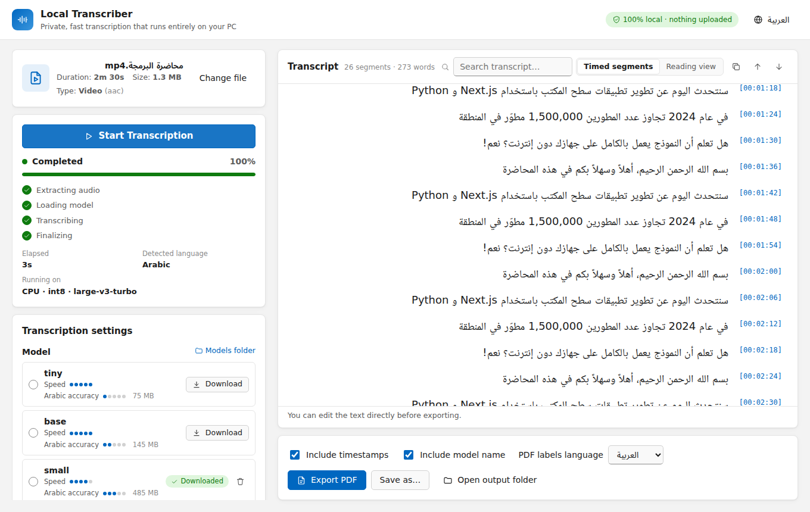

<div align="center">


# Local Transcriber

**Private, offline video & audio transcription for Windows — built for Arabic first.**

Drop a video → it's transcribed **on your own PC** → edit the text → export a clean Arabic **PDF**.

[](#requirements)
[](https://nodejs.org)
[](https://www.python.org)
[](https://github.com/SYSTRAN/faster-whisper)
[](LICENSE)

**English** · [العربية](README.ar.md)



</div>

---

## Table of contents

- [Features](#features)
- [Requirements](#requirements)
- [Quick start](#quick-start)
- [How to use](#how-to-use)
- [Choosing a model](#choosing-a-model)
- [Paid providers (Cohere, OpenAI, Groq)](#paid-providers-cohere-openai-groq)
- [Archive](#archive)
- [YouTube videos](#youtube-videos)
- [Insert into a database](#insert-into-a-database)
- [GPU (NVIDIA) support](#gpu-nvidia-support)
- [Build a Windows installer](#build-a-windows-installer)
- [Troubleshooting](#troubleshooting)
- [Project structure](#project-structure)
- [Privacy](#privacy)
- [License](#license)

---

## Features

- 🔒 **100% local by default** — with local Whisper your files are never uploaded. No accounts, no API keys, no subscriptions.
- 📴 **Works offline** — the AI model is downloaded once, then everything runs without internet.
- 🇸🇦 **Arabic first** — right-to-left interface, Arabic typography, dialect-friendly models, and ~99 other languages with auto-detection.
- ⚡ **Fast** — [faster-whisper](https://github.com/SYSTRAN/faster-whisper) + CTranslate2, automatic NVIDIA GPU acceleration, batched decoding, silence skipping.
- 🎬 **Any common format** — MP4, MKV, AVI, MOV, WEBM, MP3, WAV, M4A, FLAC and more (drag & drop supported).
- ✍️ **Live, editable transcript** — see text appear in real time, search it, fix it, switch to a reading view.
- ☁️ **Optional paid providers** — Cohere Transcribe, OpenAI or Groq with your own API key.
- 🗂️ **Archive** — every transcript saved automatically, searchable, reopenable.
- ▶️ **YouTube links** — uses the video's existing captions when available, otherwise downloads only the audio and transcribes it.
- 🗄️ **Insert into your database** — SQL Server, Oracle, MySQL or PostgreSQL, with your own SQL statement.
- 📄 **Proper Arabic PDF export** — connected letters, correct RTL order, mixed Arabic/English and numbers, optional timestamps.
- 🌙 **Light & dark mode**, Arabic / English interface.

<div align="center">

<br/><sub>Sample of the exported PDF</sub>
</div>

---

## Requirements

| | Version | How to install |
|---|---|---|
| **Windows** | 10 or 11 (64-bit) | — |
| **Node.js** | **22.12 or newer** | `winget install OpenJS.NodeJS.LTS` or [nodejs.org](https://nodejs.org) |
| **Python** | 3.10 – 3.13 (3.12 recommended) | `winget install Python.Python.3.12` or [python.org](https://www.python.org/downloads/windows/) — tick **“Add python.exe to PATH”** |
| **Git** | any | `winget install Git.Git` |
| NVIDIA GPU | *optional* | Just an up-to-date NVIDIA driver. No CUDA Toolkit needed. |

> FFmpeg is **not** needed separately — it is downloaded automatically during installation.

Check your versions:

```bash
node -v      # must be v22.12.0 or higher
python --version
```

---

## Quick start

```bash
# 1. Get the code
git clone https://github.com/<your-username>/windowsApplication.git
cd windowsApplication

# 2. Install everything (JavaScript + Python environment + FFmpeg)
npm install

# 3. Run the app
npm run dev
```

That's it. The app window opens after a few seconds.

`npm install` takes a few minutes the first time: it installs the JavaScript packages, creates a Python virtual environment in `backend/.venv`, installs faster-whisper, and — if an NVIDIA GPU is detected — the CUDA libraries. Running it again later is fast.

> 💡 **Tip:** avoid keeping the project inside a OneDrive-synced folder — `node_modules` and `backend/.venv` are large and OneDrive will try to sync them.

---

## How to use

1. **Choose a file** — drag & drop a video/audio file onto the window, or click **Choose File**.
2. **Pick settings** (the defaults are fine for Arabic):
   - **Model** — see [Choosing a model](#choosing-a-model).
   - **Spoken language** — Arabic by default, or **Auto Detect**.
   - **Device** — *Auto* uses the GPU when it's strong enough, otherwise the CPU.
   - **Priority** — *Fastest*, *Balanced* (recommended) or *Most accurate*.
3. Click **Start Transcription**. The first time you use a model it is downloaded automatically (progress is shown).
4. Watch the transcript appear live. You can **cancel** at any time.
5. **Edit** any line directly, **search** the text, or switch to the **Reading view**.
6. Click **Export PDF** (or **Save as…**). Choose whether to include timestamps.
7. Use **Open output folder** to find your PDFs (default: `Documents\Local Transcriber`).

---

## Choosing a model

| Model | Size | Speed | Arabic accuracy | Best for |
|---|---|---|---|---|
| `tiny` | 75 MB | ★★★★★ | ★☆☆☆☆ | Quick tests |
| `base` | 145 MB | ★★★★★ | ★★☆☆☆ | Very weak PCs |
| `small` | 485 MB | ★★★★☆ | ★★★☆☆ | Older laptops |
| `medium` | 1.5 GB | ★★☆☆☆ | ★★★★☆ | — |
| **`large-v3-turbo`** | 1.6 GB | ★★★★☆ | ★★★★☆ | **Default on CPU** — near-best accuracy, much faster |
| **`large-v3`** | 3.1 GB | ★☆☆☆☆ | ★★★★★ | **Default on a GPU with 6 GB+** — best Arabic & dialects |

- Each model is downloaded **once** and stored in the `models/` folder. After that it works offline.
- You can pre-download a model with its **Download** button, or delete it with the 🗑️ icon.
- If transcription is slow on your PC, try `small` with the **Fastest** priority.

---

## Paid providers (Cohere, OpenAI, Groq)

Besides local Whisper, you can transcribe with a paid cloud provider using **your own API key**. Billing is directly between you and the provider — the app never handles payment.

| Provider | Models | Notes |
|---|---|---|
| **Cohere Transcribe** | `cohere-transcribe-arabic-07-2026` (Arabic), `cohere-transcribe-03-2026` (14 languages) | Requires choosing the spoken language (no auto-detect) |
| **OpenAI** | `gpt-4o-transcribe`, `gpt-4o-mini-transcribe`, `whisper-1` | |
| **Groq** | `whisper-large-v3-turbo`, `whisper-large-v3` | Very fast |

1. In **Transcription settings → Transcription engine**, choose **Paid provider**.
2. Pick the provider and model, paste your API key, click **Test** (a free check — nothing is transcribed).
3. Choose the spoken language and click **Start Transcription** as usual.

- The key is stored **encrypted with Windows DPAPI** on your PC and is sent only to that provider.
- Only the **speech parts** of the audio are uploaded (silence is skipped), as short chunks sent in parallel. Each chunk's position in the original file gives the timestamps — even for providers that return none — and no file-size limit is ever hit.
- When a paid provider is selected, the header shows **“Cloud: audio is uploaded to …”** so it's always clear where your audio goes.

---

## Archive

Every transcript is saved automatically in a local archive — files, YouTube links, local Whisper or paid providers — and your edits are saved too.

- Click **Archive** in the top bar to browse, **search** (titles and text; Arabic diacritics and letter variants are ignored), **open** or **delete** transcripts.
- An opened transcript can be edited, exported to PDF or inserted into a database like a new one.
- The archive is a SQLite file in `%APPDATA%\Local Transcriber\archive.db` and never leaves your PC.

---

## YouTube videos

Paste a YouTube link in the field under the drop zone (or just paste it — it is fetched automatically):

- **If the video has captions on YouTube**, they are listed — captions uploaded by the channel first (usually the most accurate), then YouTube's automatic captions. Click **Use** and the transcript appears instantly, with timestamps — no model and no download needed.
- **If it has no captions**, the app tells you it will create them: choose the model and settings as usual and click **Start Transcription**. Only the **audio** is downloaded (about 1 MB per minute), then it is transcribed locally like any file.
- You can always ignore existing captions and click **Start Transcription** to use Whisper instead.

Everything else — editing, PDF export, inserting into a database — works the same.

> YouTube changes often. If links suddenly stop working, run `npm run update:youtube` to update the YouTube tool ([yt-dlp](https://github.com/yt-dlp/yt-dlp)). Only transcribe videos you have the right to use.

---

## Insert into a database

After transcribing, click **Insert into database** to write the transcript straight into your own database — **SQL Server, Oracle, MySQL/MariaDB or PostgreSQL** — with an SQL statement you write yourself.

1. Choose the database type and paste your **connection string**, then click **Test connection**.

   | Database | Example connection string |
   |---|---|
   | SQL Server | `Server=myserver,1433;Database=MyDb;User Id=myuser;Password=mypassword;TrustServerCertificate=True;` |
   | Oracle | `myuser/mypassword@myhost:1521/ORCLPDB1` |
   | MySQL / MariaDB | `Server=myhost;Port=3306;Database=mydb;Uid=myuser;Pwd=mypassword;` |
   | PostgreSQL | `Host=myhost;Port=5432;Database=mydb;Username=myuser;Password=mypassword` |

2. Choose the **insert shape**: one row per ~N-second chunk, one row per Whisper segment, or one row for the whole transcript.
3. Add **your own variables** if needed (e.g. `lesson_id = 42`).
4. Write the statement using variables with `@` (or `:` for Oracle):

   ```sql
   -- optional, runs once before the inserts
   DELETE FROM LessonTranscripts WHERE LessonId = @lesson_id;

   -- runs once per row
   INSERT INTO LessonTranscripts (LessonId, StartSeconds, EndSeconds, [Text])
   VALUES (@lesson_id, @start_seconds, @end_seconds, @text);
   ```

5. Click **Preview** to see the first rows, then **Run insert** and confirm.

**Available variables**

| Per row | Per file |
|---|---|
| `text`, `start_seconds`, `end_seconds`, `start_time`, `end_time`, `segment_index` | `file_name`, `file_path`, `language`, `model`, `duration_seconds`, `segment_count`, `full_text`, `transcribed_at` |

- Values are sent as **bound parameters**, never pasted into the SQL, so Arabic text, quotes and `%` are always safe (no SQL injection).
- Everything runs in **one transaction**: if any row fails, nothing is inserted (including the “before” statement).
- Profiles (connection + SQL) can be saved. The connection string is **encrypted with Windows DPAPI** and stored only on your PC.
- Drivers are installed automatically by `npm install` / `npm run setup` — no database client is needed. For SQL Server with *Windows authentication* (`Integrated Security=True`), install Microsoft's “ODBC Driver 18 for SQL Server”.

---

## GPU (NVIDIA) support

The app detects your GPU automatically:

- **Capable GPU** (4 GB+ VRAM, GTX 10-series or newer): *Auto* uses it — typically many times faster than the CPU. Cards with 6 GB+ default to `large-v3`, smaller ones to `large-v3-turbo`.
- **Entry-level GPU** (e.g. GeForce MX110/MX130/MX150 with 2 GB): *Auto* uses the **CPU**, which is faster and more stable on these cards. You can still select GPU manually for small models.
- **No NVIDIA GPU** (AMD / Intel): the CPU is used.

If the GPU fails for any reason, the app automatically switches to the CPU and shows a notice.

Useful commands:

```bash
npm run doctor      # shows Python, FFmpeg, GPU and CUDA status
npm run setup:gpu   # (re)install the NVIDIA CUDA/cuDNN libraries
npm run setup:cpu   # CPU-only environment
```

---

## Build a Windows installer

Run on Windows:

```bash
npm run dist
```

This produces `release/LocalTranscriber-Setup-<version>.exe` — a normal Windows installer. People who install it do **not** need Node.js, Python or FFmpeg.

| Command | Result |
|---|---|
| `npm run dist` | Full installer (`.exe`) in `release/` |
| `npm run pack` | Unpacked app in `release/win-unpacked/` (quick test) |
| `npm run build` | Only builds the UI and the backend |

> If the build machine has an NVIDIA GPU, the CUDA libraries are bundled (~+800 MB) so GPU acceleration works for end users. For a smaller CPU-only installer, run `npm run setup:cpu` in a fresh clone before `npm run dist`.

The installed app stores models in `%LOCALAPPDATA%\Local Transcriber\models` and logs in `%APPDATA%\Local Transcriber\logs`.

---

## Troubleshooting

| Problem | Solution |
|---|---|
| `EBADENGINE` warnings / Electron won't start | Your Node.js is older than 22.12. Install Node 22 LTS, delete `node_modules`, run `npm install` again. |
| “Python environment is not installed” | Install Python 3.12 (with *Add to PATH*), then run `npm run setup`. |
| `'npm' is not recognized` | Install Node.js and open a **new** terminal window. |
| “FFmpeg was not found” | Run `npm install` again. |
| Model download failed | Internet is needed the first time only. Check your connection or proxy and retry — partial downloads resume. |
| “Not enough memory” / slow on a laptop | The app runs in memory-saving mode automatically when RAM is low. For more speed, close your browser and other apps, and use `npm run app` instead of `npm run dev` — the development server alone uses several hundred MB. |
| GPU not used | Update the NVIDIA driver, run `npm run setup:gpu`, then `npm run doctor`. |
| “No speech was detected” | The file has no audible speech (music/silence) or no audio track. |
| PDF can't be saved | Close the PDF if it's open in another program and export again. |
| YouTube link fails / “confirm you're not a bot” | Run `npm run update:youtube`, wait a little and retry. Private, members-only and age-restricted videos can't be fetched. |
| Paid provider: “API key is invalid” / “quota exhausted” | Check the key with **Test**, and your balance/plan in the provider's dashboard. Cohere needs a language selected (not Auto Detect). |
| Anything else | Check `%APPDATA%\Local Transcriber\logs\backend.log` and run `npm run doctor`. |

---

## Project structure

```
windowsApplication/
├── electron/          # Windows desktop shell (window, dialogs, starts the backend)
├── frontend/          # User interface — Next.js + React + TypeScript
├── backend/           # Python — faster-whisper, FFmpeg, PDF export (FastAPI, local only)
├── scripts/           # Node scripts used by npm (setup, dev, build, doctor)
├── models/            # Downloaded AI models (not committed to git)
├── build/             # App icons
├── docs/              # Screenshots & technical docs
└── package.json       # All commands: install / dev / build / dist
```

For how it works internally (architecture, security model, performance), see **[docs/ARCHITECTURE.md](docs/ARCHITECTURE.md)**.

### All npm commands

| Command | What it does |
|---|---|
| `npm install` | Installs everything (runs `npm run setup` automatically) |
| `npm run dev` | Starts the app in development mode (hot reload) |
| `npm run app` | Builds the UI once and starts the app — uses less memory, best for daily use |
| `npm run setup` | Re-creates / repairs the Python environment |
| `npm run doctor` | Prints a diagnostic report |
| `npm run update:youtube` | Updates the YouTube tool (yt-dlp) |
| `npm run dist` | Builds the Windows installer |
| `npm run typecheck` | TypeScript check |

---

## Privacy

- Your media files are **read from your disk only** — they are never uploaded.
- Transcripts and PDFs stay on your computer.
- No analytics, no telemetry, no accounts, no API keys.
- With a **paid provider** selected, the speech audio is uploaded to that provider (you choose this explicitly; the header shows it).
- Otherwise, internet is used only for the one-time model download from the public [Hugging Face Hub](https://huggingface.co/Systran), and — when **you** paste a YouTube link — to fetch that video's captions or audio from YouTube.
- The internal backend listens on `127.0.0.1` only and is protected by a random per-launch token.

---

## License

[MIT](LICENSE) © 2026

Built with [faster-whisper](https://github.com/SYSTRAN/faster-whisper), [CTranslate2](https://github.com/OpenNMT/CTranslate2), [OpenAI Whisper](https://github.com/openai/whisper) models, [Next.js](https://nextjs.org), [Electron](https://www.electronjs.org), [FFmpeg](https://ffmpeg.org) and [fpdf2](https://github.com/py-pdf/fpdf2).
Fonts: [Amiri](https://github.com/aliftype/amiri), Noto Sans Arabic, Noto Naskh Arabic — SIL Open Font License 1.1.
